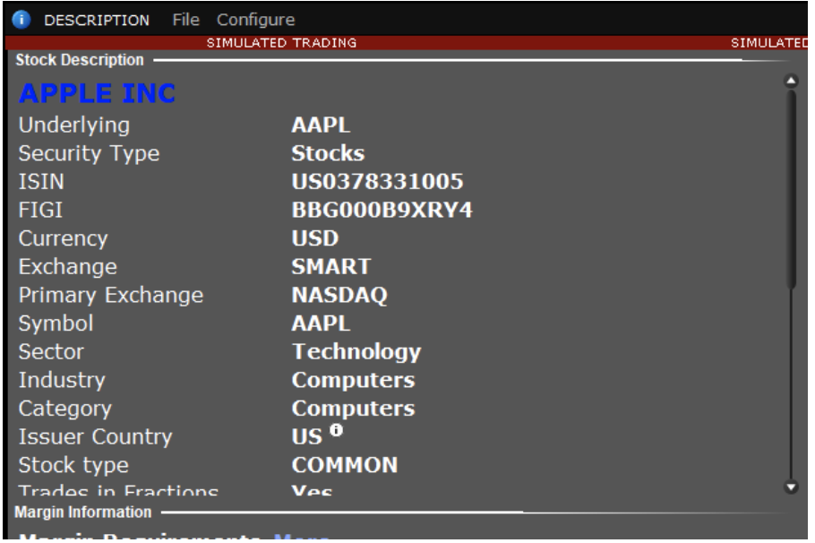
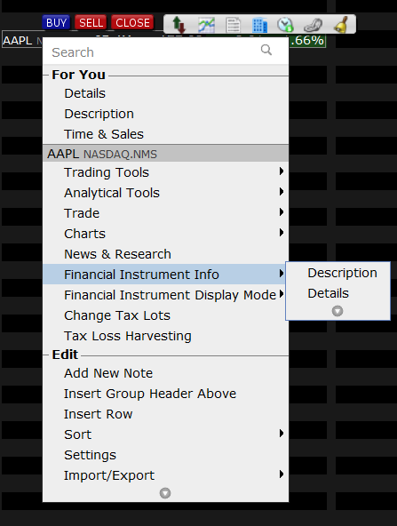

- [Contracts (Financial Instruments)](#contracts-financial-instruments)
  - [The Contract Object](#the-contract-objectcopy-location)
  - [Finding Contract Details in Trader Workstation](#finding-contract-details-in-trader-workstation)

# Contracts (Financial Instruments)

`IBApi.Contract` 对象代表交易工具，例如股票、期货或期权。每当向 TWS（交易工作站）发送需要合约的新请求（例如市场数据、下单等）时，平台会尝试将提供的合约对象与单一候选对象进行匹配。

这种机制确保了交易指令的准确性，因为在执行市场数据查询、订单下达等操作之前，必须明确指定和识别特定的交易工具。`Contract` 对象通过其属性（如标的代码、交易所、货币等）为这些操作提供了必要的详细信息。

## The Contract Object

`Contract` 对象在整个 TWS API 中被广泛用于定义请求的目标。`Contract` 对象用于市场数据、投资组合、订单、执行情况，甚至某些新闻请求。它是 TWS API 所有操作的基础结构。

在所有合约中，最低可行结构至少需要一个合约 ID（conId）和交易所，或者一个标的代码（symbol）、证券类型（secType）、交易所（exchange）、主要交易所（primaryExchange）和货币（currency）。衍生品需要额外的字段，例如最后交易日期或到期日（lastTradeDateOrExpiration）、交易类别（tradingClass）、乘数（multiplier）、执行价（strikes）等。

以下是创建完整合约时最常用的 `Contract` 值。要获得更全面的合约结构列表，请参阅 Contracts 页面。

`Contract()` 方法的参数包括：

- `ConId: int`：标识符，用于指定确切的合约。
- `Symbol: String`：标的工具的股票代码。
- `SecType: String`：交易工具的证券类型。
- `Exchange: String`：数据或交易应该路由的交易所。
- `PrimaryExchange: String`：工具的主要上市交易所。
- `Currency: String`：工具交易的基础货币。
- `LastTradeDateOrContractMonth: String`：对于衍生品，合约的到期日期。
- `Strike: double`：对于衍生品，工具的执行价。
- `Right: String`：对于衍生品，工具的权利（P/C）。
- `TradingClass: String`：对于衍生品，工具的交易类别。可能用于区分月度或周度合约。

## Finding Contract Details in Trader Workstation

如果存在多个符合相同描述的合约，TWS（交易工作站）将返回错误，通知您存在歧义。在这些情况下，TWS 需要更多信息来缩小符合提供的描述的合约列表，以确定单一合约。

在 TWS 中找到合约的描述是最佳方式。在 TWS 内部，您可以通过双击合约或通过右键点击合约选择“合约信息 -> 描述”菜单来轻松检查合约的描述：

此时，合约的描述将显示出来。

注意：您可以通过选择“合约信息 -> 详细信息”来查看扩展的合约详情。此选项将打开一个网页，显示合约的所有可用信息。

每当通过 TWS API 提供合约描述时，TWS 将尝试将给定的描述与单一合约匹配。这种机制提供了极大的灵活性，因为它允许以多种方式定义同一合约。

定义合约的最简单方式是提供其标的代码、证券类型、货币和交易所。大多数股票、差价合约（CFD）、指数或外汇对可以通过这四个属性唯一定义。由于其性质，更复杂的合约如期权和期货需要一些额外信息。下面是不同类型工具的几个示例。