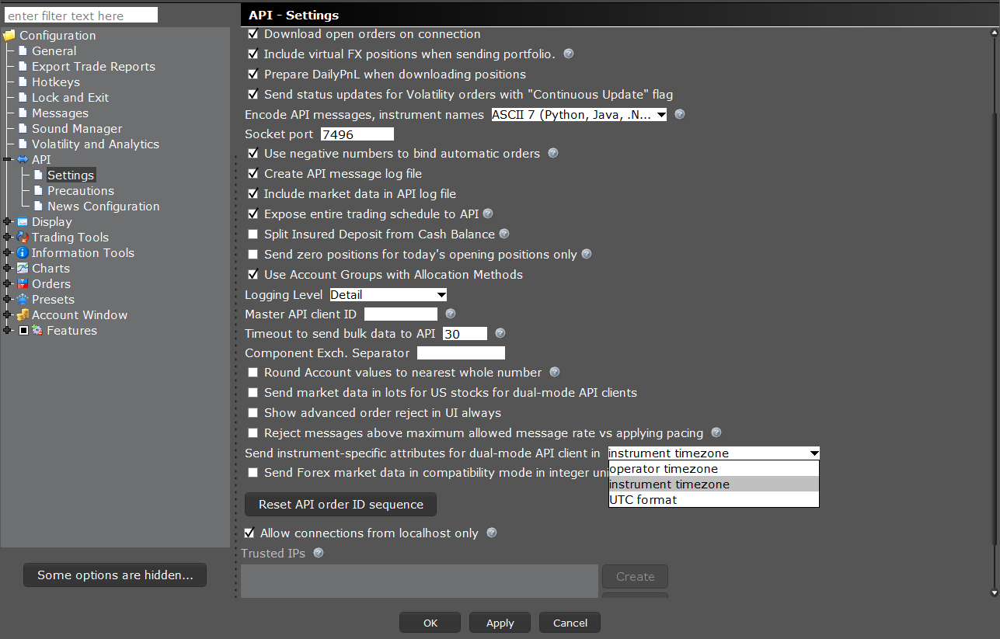

- [Market Data: Delayed](#market-data-delayed)
  - [Historical Data LimitationsCopy Location](#historical-data-limitationscopy-location)
    - [Historical Data Filtering](#historical-data-filtering)
    - [Pacing Violations for Small Bars (30 secs or less)](#pacing-violations-for-small-bars-30-secs-or-less)
    - [Step Size](#step-size)
    - [Unavailable Historical Data](#unavailable-historical-data)
  - [Finding the Earliest Available Data Point](#finding-the-earliest-available-data-point)
    - [Requesting the Earliest Data Point](#requesting-the-earliest-data-point)
    - [Receiving the Earliest Data Point](#receiving-the-earliest-data-point)
    - [Cancelling Timestamp Requests](#cancelling-timestamp-requests)
  - [Historical Bars](#historical-bars)
    - [Duration](#duration)
    - [Historical Bar Sizes](#historical-bar-sizes)
    - [Step Sizes](#step-sizes)
    - [Format Date Received](#format-date-received)
    - [Keep Up To Date](#keep-up-to-date)
    - [Receiving Historical Bars](#receiving-historical-bars)
  - [Historical Bar whatToShow](#historical-bar-whattoshow)
  - [Histogram Data](#histogram-data)
    - [Requesting Histogram Data](#requesting-histogram-data)
    - [Receiving Histogram Data](#receiving-histogram-data)
    - [Cancelling Histogram Data](#cancelling-histogram-data)
  - [Historical Time \& Sales](#historical-time--sales)
    - [Requesting Time and Sales data](#requesting-time-and-sales-data)
    - [Receiving Time and Sales data](#receiving-time-and-sales-data)
    - [Historical Halted and Unhalted ticks](#historical-halted-and-unhalted-ticks)
  - [Modifying Returned Date](#modifying-returned-date)


# Market Data: Delayed

交互式经纪人（Interactive Brokers）为其市场数据订阅者提供多种方法和结构来访问历史市场数据。这包括：

1. **历史柱状图数据**：这些数据类似于交易工作站（Trader Workstation）中的数据，包括特定时间段内的开盘价、最高价、最低价和收盘价等信息。

2. **历史时间与销售数据（Time & Sales）**：提供了特定时间范围内的详细交易信息，如交易的时间、价格和数量等。

3. **直方图数据**：这种数据可以用来分析特定时间范围内价格或其他指标的分布情况。

这些数据为投资者提供了对市场历史表现的深入了解，对于市场分析、交易策略的制定和回溯测试等非常有用。通过 API，用户可以灵活地请求并接收这些数据，以满足他们的具体需求和分析目标。

## Historical Data LimitationsCopy Location

历史市场数据在交易工作站（Trader Workstation, TWS）API中有其独特的市场数据限制，这些限制与实时市场数据等其他请求的限制不同。以下是影响 TWS API 中历史市场数据的所有限制：

1. **数据量限制**：对于单个请求的数据点数量可能有限制。例如，请求可能被限制为一定数量的柱状图数据点。

2. **时间范围限制**：可能存在对请求数据的时间范围的限制。例如，某些类型的数据可能只能访问过去几年的数据。

3. **请求频率限制**：可能有关于可以发出请求的频率的限制。这意味着在一定时间内只能发送一定数量的历史数据请求。

4. **数据精度**：不同类型的历史数据（如分钟数据、日数据）可能有不同的精度和细节水平。

5. **特定合约限制**：某些合约可能有特定的数据访问限制，这取决于合约类型和交易所。

了解这些限制对于有效地使用 TWS API 请求和处理历史市场数据至关重要，尤其是在进行市场分析和交易策略开发时。用户应该根据这些限制规划他们的数据请求策略，以确保他们能够获取所需的数据，同时遵守相关规则和限制。

### Historical Data Filtering

交互式经纪人（Interactive Brokers, IB）的历史数据对远离国家最优买卖报价（NBBO）发生的交易类型进行了过滤，例如组合腿、大宗交易和衍生品交易。因此，来自（未过滤的）实时数据功能的日交易量通常会大于（过滤后的）历史数据功能报告的历史交易量。此外，在实时数据和历史数据源之间的其他字段，如加权平均价格（VWAP），也预期会有差异。

### Pacing Violations for Small Bars (30 secs or less)

尽管交互式经纪人（Interactive Brokers, IB）为客户提供高质量的市场数据，但由于 IB 并非专业的市场数据提供商，因此必须设定限制，以限制与交易不直接相关的流量。当以下任一限制未被遵守时，将发生“节奏违规”（Pacing Violation）：

重要提示：这些限制适用于所有客户，且无法绕过。如果您的交易策略的市场数据需求无法通过我们的市场数据服务得到满足，请考虑联系专业的数据提供商。

1. 在15秒内对相同的历史数据进行重复请求。
2. 在两秒内对同一合约、交易所和刻度类型进行六次或以上的历史数据请求。
3. 在任何十分钟时段内进行超过60次请求。
   

请注意，当请求 BID_ASK 历史数据时，每次请求将被计算两次。简而言之，上述信息可以简单理解为“不要太快请求太多数据”。

### Step Size

步长（Step Size）定义为历史数据请求的持续时间与其粒度（即柱状图大小）之间的比率。历史数据请求需要以这样的方式组装：一次只返回几千个柱状图。以下表格示例说明了这一概念：

| 持续时间 | 柱状图大小   |
| -------- | ------------ |
| 60       | 1秒 - 1分    |
| 120      | 1秒 - 2分    |
| 1800     | 1秒 - 30分   |
| 3600     | 5秒 - 1小时  |
| 14400    | 10秒 - 3小时 |
| 28800    | 30秒 - 8小时 |
| 1D       | 1分钟 - 1天  |
| 2D       | 2分钟 - 1天  |
| 1W       | 3分钟 - 1周  |
| 1M       | 30分钟 - 1月 |
| 1Y       | 1天 - 1月    |

为了避免数据请求的过载和节奏违规，历史数据请求应当以这样的方式构建，以确保一次性请求的数据量不会过大。通过调整请求的持续时间和柱状图的大小，可以在保持数据请求有效性的同时，获得所需的历史数据信息。


### Unavailable Historical Data

交易平台通用的历史数据限制如下：

- 六个月以上的、柱状图大小为30秒或更小的数据。
- 期货过期日起两年以上的过期期货数据。
- 过期的期权、期货期权（FOPs）、权证和结构化产品的数据。
- 期权、期货期权（FOPs）、权证和结构化产品的日终（EOD）数据。
- 已过期期货组合的数据。
- 不再交易的证券数据。
- 组合交易的原始历史数据。组合的历史数据不单独存储在 IB 数据库中；TWS 或 API 中的组合历史数据是来自各腿部的数据之和。
- 移至新交易所的证券的历史数据，通常在移动之前不可用。
- 从 API 中无法获取加权移动平均、布林带等研究和指标。可用的有成交量加权平均价格（VWAP）。

了解这些限制有助于更好地规划和执行历史数据查询，特别是在进行市场分析和策略回测时。需要注意的是，这些限制可能因平台和市场变化而有所不同。

## Finding the Earliest Available Data Point

对于许多函数，例如 `EClient.reqHistoricalData`，您需要为一个合约请求市场数据。考虑到您可能不知道一个标的代码已经可用了多长时间，您可以使用 `EClient.reqHeadTimestamp` 函数来找出给定 `whatToShow` 值的第一个可用数据点。

`EClient.reqHeadTimestamp` 函数允许用户查询特定合约在指定数据类型（如成交量、成交价格等）下的历史数据的最早可用时间点。这对于评估数据的完整性和进行历史分析非常重要，尤其是在处理较长时间范围内的历史数据时。通过了解合约数据的开始时间，用户可以更有效地规划他们的历史数据请求，确保所获取的数据对其分析和决策有用。

### Requesting the Earliest Data Point

`EClient.reqHeadTimestamp` 方法用于返回特定合约和数据类型的最早可用历史数据的时间戳。该方法的参数包括：

- `tickerId: int`：将用于识别传入数据的唯一标识符。
- `contract: Contract`：您感兴趣的 `IBApi.Contract`。
- `whatToShow: String`：要检索的数据类型。参见历史数据类型。
- `useRTH: int`：是否（1）或不（0）仅检索在常规交易时段（RTH）内生成的数据。
- `formatDate: int`：使用 1 将以 YYYYMMDD-hh:mm:ss 格式返回 UTC 时间。使用 2 将返回 epoch 时间。

这个方法可以帮助用户确定对于特定合约，在指定的数据类型（例如成交量、成交价格等）下，可用的历史数据的开始时间。这对于那些需要进行历史数据分析的用户非常有用，特别是在需要了解数据可用性和完整性时。通过了解数据的时间范围，用户可以更有效地规划他们的历史数据查询，以确保所获取的数据对于他们的分析和策略具有相关性。

```python
self.reqHeadTimeStamp(1, ContractSamples.USStockAtSmart(), "TRADES", 1, 1)
```

### Receiving the Earliest Data Point

`EWrapper.headTimestamp` 方法用于接收 `EClient.reqHeadTimestamp` 请求的响应数据。该方法的参数包括：

- `requestId: int`：用于跟踪数据的请求标识符。
- `headTimestamp: String`：标识最早数据日期的值。

当数据被请求时，响应的数据将返回到 `EWrapper.headTimestamp`。这个方法提供了特定合约和请求类型的历史数据最早可用时间点，这对于用户了解和规划他们的历史数据查询非常重要，特别是在需要对数据的时间范围有精确了解的情况下。通过这种方式，用户可以更准确地确定何时开始他们的数据分析，以确保所用的历史数据对于他们的研究或交易策略是适当和有效的。

```python
def headTimestamp(self, reqId, headTimestamp):
    print(reqId, headTimestamp)
```

### Cancelling Timestamp Requests

`EWrapper.cancelHistogramData` 方法用于取消先前通过 `EClient.reqHistogramData` 发起的直方图数据请求。该方法的参数包括：

- `tickerId: int`：用于跟踪数据的请求标识符。

另外，`EClient.cancelHeadTimestamp` 方法可用于取消之前通过 `EClient.reqHeadTimestamp` 发起的请求。这些取消功能对于管理数据流和避免不必要的数据处理非常重要，尤其是在高频率请求或动态调整数据请求策略的情况下。通过取消不再需要的请求，用户可以确保他们的应用程序只处理最相关和最新的数据，从而提高效率和响应速度。

## Historical Bars

`EClient.reqHistoricalBars` 方法用于请求历史柱状图数据。该方法的参数包括：

- `tickerId: int`：用于识别传入数据的唯一标识符。
- `contract: Contract`：您正在使用的 `IBApi.Contract` 对象。
- `endDateTime: String`：请求的结束日期和时间。应该格式化为“YYYYMMDD HH:mm:ss”，空字符串表示当前时刻。
- `durationString: String`：从请求给定的结束日期和时间向后回溯的时间量（或有效持续时间字符串单位）。
- `barSizeSetting: String`：数据的粒度或有效的柱状图大小。
- `whatToShow: String`：要检索的数据类型。参见历史数据类型。
- `useRTH: bool`：是否（1）或不（0）仅检索在常规交易时段（RTH）内生成的数据。
- `formatDate: bool`：传入柱状图的日期应呈现的格式。注意，对于日柱状图，只有 yyyyMMdd 格式可用。
- `keepUpToDate: bool`：是否订阅以返回实时柱状图未完成的实时更新（True），或者一次性返回所有数据（False）。如果为 True，则不能指定 endDateTime。
- `mktDataOptions: TagValueList`：这是一个仅供内部使用的字段。

此方法允许用户根据指定的合约、时间范围和数据类型获取历史柱状图数据。这些数据可以用于市场分析、交易策略开发和历史性能评估等多种用途。通过精确控制请求的数据类型和时间范围，用户可以确保他们获取的数据与其分析需求紧密相关。

```python
    self.reqHistoricalData(4102, contract, queryTime, "1 M", "1 day", "MIDPOINT", 1, 1, False, [])
```

### Duration

交互式经纪人（Interactive Brokers）历史市场数据具有一个持续时间参数，用于指定可以收集数据的总时长。指定的持续时间将决定可以收集的数据柱状图的数量。

持续时间参数非常重要，因为它直接影响您可以获取的历史数据的范围。例如，如果您指定一个较长的持续时间，您将能够获取更长期的历史数据；但这也可能受到历史数据请求的其他限制（如数据量限制或节奏违规）的影响。正确设置持续时间参数是确保获取到符合您分析需求的历史数据的关键。通过调整持续时间和柱状图的大小，您可以优化数据请求，以获得所需的历史市场信息，同时遵守 API 的限制和约束。

Valid Duration String Units:

| Unit | Description |
| ---- | ----------- |
| S    | Seconds     |
| D    | Day         |
| W    | Week        |
| M    | Month       |
| Y    | Year        |


### Historical Bar Sizes

柱状图大小决定了历史柱状图请求返回的数据。柱状图的大小将决定返回给 API 的开盘价（O）、最高价（H）、最低价（L）、收盘价（C）以及成交量（V）的时间尺度。

柱状图大小的选择对于数据分析非常重要，因为它影响数据的粒度。例如：

- **较小的柱状图大小**（如1分钟）提供了更详细的数据，适合短期交易分析或高频交易策略。
- **较大的柱状图大小**（如1天）提供了更宏观的视角，适合长期趋势分析或投资决策。

选择合适的柱状图大小是确保获取对您的交易或分析策略最有用的数据的关键。用户需要根据他们的具体需求和交易策略来选择最适合的柱状图大小。同时，柱状图大小的选择也应考虑到数据请求限制，如频率限制和数据点数量限制。

Valid Bar Sizes:

| Bar Unit | Bar Sizes                  |
| -------- | -------------------------- |
| secs     | 1, 5, 10, 15, 30           |
| mins     | 1, 2, 3, 5, 10, 15, 20, 30 |
| hrs      | 1, 2, 3, 4, 8              |
| days     | 1                          |
| weeks    | 1                          |
| months   | 1                          |

### Step Sizes

市场数据请求的功能基于预设的步长。因此，并非所有柱状图大小都适用于所有持续时间值。下面的表格将讨论每个持续时间字符串的最小到最大柱状图大小值。

这种步长和柱状图大小的关系决定了用户可以请求的数据类型和数量。选择合适的柱状图大小和持续时间是确保数据请求既符合交互式经纪人（Interactive Brokers）的限制，又能满足分析需求的关键。了解不同持续时间与柱状图大小之间的兼容性，可以帮助用户更有效地规划和执行他们的历史数据查询。

| Duration Unit | Bar units allowed | Bar size Interval (Min/Max) |
| ------------- | ----------------- | --------------------------- |
| S             | secs ¥ mins       | 1 secs -> 1mins             |
| D             | secs ¥ mins ¥ hrs | 5 secs -> 1 hours           |
| W             | sec ¥ mins ¥ hrs  | 10 secs -> 4 hrs            |
| M             | sec ¥ mins ¥ hrs  | 30 secs -> 8 hrs            |
| Y             | mins ¥ hrs ¥ d    | 1 mins-> 1 day              |

### Format Date Received

交互式经纪人（Interactive Brokers）会根据请求中设置的格式返回历史市场数据。`formatDate` 参数可以提供一个整数值，以指示数据应如何返回。

需要注意的是：

- 对于日柱状图（Day bars），只会以 `yyyyMMdd` 格式返回日期。时间数据不可用。
- `formatDate` 参数的值决定了返回数据的时间格式。通常，值为 `1` 时返回的是 UTC 时间的 `YYYYMMDD-HH:MM:SS` 格式，而值为 `2` 时返回的是自 Unix 纪元以来的秒数（epoch time）。

选择正确的 `formatDate` 值对于确保您能够正确解析和使用返回的历史数据至关重要，特别是当数据需要与其他数据源或分析工具集成时。对于只需要日期而不需要具体时间的分析，使用日柱状图并以 `yyyyMMdd` 格式接收数据将是合适的选择。

| Value | Description           | Example                              |
| ----- | --------------------- | ------------------------------------ |
| 1     | String Time Zone Date | “20231019 16:11:48 America/New_York” |
| 2     | Epoch Date            | 1697746308                           |
| 3     | Day & Time Date       | “1019 16:11:48 America/New_York”     |

### Keep Up To Date

当在历史数据请求中使用 `keepUpToDate=True` 时，您会看到多个柱状图具有相同的时间戳。这是因为数据大约每1-2秒更新一次。这些更新会累积，直到指定的柱状图大小结束。

在我们的示例中，请求了15秒的柱状图，我们可以看到30秒的柱状图逐步构建，直到 20231204 13:30:30 完成。此时，我们开始构建45秒的柱状图。这种逻辑同样适用于分钟、小时或日柱状图。

这种方法允许用户实时观察市场数据的变化，而不是只在柱状图的最终时间点获取数据。例如，对于15秒的柱状图，您将能看到每个15秒间隔内数据的每1-2秒的更新，而不是只在每个15秒结束时的单个数据点。这对于需要密切跟踪市场动态的交易策略或分析非常有用。

```
Date: 20231204 13:30:30 US/Eastern, Open: 188.56, High: 188.56, Low: 188.54, Close: 188.55, Volume: 3550, WAP: 188.5532535211268, BarCount: 19
Date: 20231204 13:30:30 US/Eastern, Open: 188.56, High: 188.56, Low: 188.54, Close: 188.55, Volume: 3550, WAP: 188.5532535211268, BarCount: 19
Date: 20231204 13:30:30 US/Eastern, Open: 188.56, High: 188.56, Low: 188.54, Close: 188.55, Volume: 3550, WAP: 188.5532535211268, BarCount: 19
Date: 20231204 13:30:30 US/Eastern, Open: 188.56, High: 188.56, Low: 188.54, Close: 188.55, Volume: 3550, WAP: 188.5532535211268, BarCount: 19
Date: 20231204 13:30:30 US/Eastern, Open: 188.56, High: 188.56, Low: 188.54, Close: 188.55, Volume: 3550, WAP: 188.5532535211268, BarCount: 19
Date: 20231204 13:30:30 US/Eastern, Open: 188.56, High: 188.56, Low: 188.54, Close: 188.56, Volume: 5255, WAP: 188.5549248334919, BarCount: 34
Date: 20231204 13:30:30 US/Eastern, Open: 188.56, High: 188.56, Low: 188.54, Close: 188.56, Volume: 5255, WAP: 188.5549248334919, BarCount: 34
Date: 20231204 13:30:30 US/Eastern, Open: 188.56, High: 188.57, Low: 188.54, Close: 188.55, Volume: 6787, WAP: 188.5545248268749, BarCount: 47
Date: 20231204 13:30:45 US/Eastern, Open: 188.54, High: 188.54, Low: 188.54, Close: 188.54, Volume: -1, WAP: 188.54, BarCount: -1
```

### Receiving Historical Bars

`EWrapper.historicalData` 方法用于接收通过 `EClient.reqHistoricalData` 请求的历史数据。该方法的参数包括：

- `reqId: int`：用于跟踪数据的请求标识符。
- `bar: Bar`：包含开盘价（O）、最高价（H）、最低价（L）、收盘价（C）的历史数据柱状图。柱状图的时间区是在 TWS 登录屏幕上选择的时间区。最小的柱状图大小是1秒。

历史数据将以蜡烛图的形式通过 `EWrapper.historicalData` 方法传送。返回的柱状图的时间区是在 TWS 登录时选择的时间区。这个功能使得用户可以接收到详细的历史市场数据，用于进行市场分析、交易策略的回测和其他相关的金融研究。理解和正确处理这些数据对于确保分析的准确性和有效性至关重要。

```python
def historicalData(self, reqId:int, bar: BarData):
    print("HistoricalData. ReqId:", reqId, "BarData.", bar)
```

----

`EWrapper.historicalSchedule` 方法用于接收历史时间表数据。当 `whatToShow` 参数设置为“schedule”时，此方法将被调用。该方法的参数包括：

- `reqId: int`：用于跟踪数据的请求标识符。
- `startDateTime: String`：返回历史时间表范围的开始日期和时间。
- `endDateTime: String`：返回历史时间表范围的结束日期和时间。
- `timeZone: String`：返回时间表所引用的时区。
- `sessions: HistoricalSession[]`：返回持续时间内历史时间表数据的完整块。

`EWrapper.historicalSchedule` 是一个独特的方法，仅在 `whatToShow` 值用于显示日历信息的特殊情况下被调用。这种方法使得用户可以获取关于特定合约在特定时间范围内的历史交易时段信息，这对于理解市场的历史交易模式和计划交易活动非常有用。通过这些信息，用户可以更好地了解特定合约在过去的特定日期和时间内的交易情况。

```python
def historicalSchedule(self, reqId: int, startDateTime: str, endDateTime: str, timeZone: str, sessions: ListOfHistoricalSessions):
    print("HistoricalSchedule. ReqId:", reqId, "Start:", startDateTime, "End:", endDateTime, "TimeZone:", timeZone)
    for session in sessions:
        print("\tSession. Start:", session.startDateTime, "End:", session.endDateTime, "Ref Date:", session.refDate)
```

----

`EWrapper.historicalDataUpdate` 方法用于接收实时更新的历史数据柱状图，如果在 `reqHistoricalData` 中设置了 `keepUpToDate` 为 True。该方法的参数包括：

- `reqId: int`：用于跟踪数据的请求标识符。
- `bar: Bar`：包含开盘价（O）、最高价（H）、最低价（L）、收盘价（C）的历史数据柱状图。柱状图的时间区是在 TWS 登录屏幕上选择的时间区。最小的柱状图大小是1秒。

此方法在功能上类似于 `realTimeBars` 函数，不同之处在于返回的数据是历史数据和实时数据的综合，相当于 TWS 图表功能中用于保持图表更新的数据。返回的柱状图通过实时数据成功更新。这使得用户可以实时观察市场数据的变化，而不是只在柱状图的最终时间点获取数据。这对于需要密切跟踪市场动态的交易策略或分析非常有用。

```python
def historicalDataUpdate(self, reqId: int, bar: BarData):
    print("HistoricalDataUpdate. ReqId:", reqId, "BarData.", bar)
```

----

`EWrapper.historicalDataEnd` 方法用于标记历史柱状图数据接收的结束。该方法的参数包括：

- `reqId: int`：用于跟踪数据的请求标识符。
- `start: String`：返回第一个历史数据柱状图的开始时间。
- `end: String`：返回最后一个历史数据柱状图的结束时间。

当 `EClient.reqHistoricalData` 请求的历史数据全部传送完毕时，`EWrapper.historicalDataEnd` 方法被调用。这个方法对于用户来说是一个重要的信号，表明他们请求的所有历史数据已经接收完毕，可以开始进行数据分析和处理。通过这种方式，用户可以确信他们已经获得了完整的数据集，从而在进行市场分析或策略回测时使用准确和完整的信息。

```python
def historicalDataEnd(self, reqId: int, start: str, end: str):
    print("HistoricalDataEnd. ReqId:", reqId, "from", start, "to", end)
```

## Historical Bar whatToShow

以下是可以用作历史柱请求中 `WhatToShow` 值的历史柱类型。这些值用于请求不同类型的数据，如成交数据、中点数据、买卖盘（Bid/Ask）数据等。不同类型的柱状图支持的产品范围有所不同。请注意每种柱型类型支持的产品：

**AGGTRADES**

| Open            | High                | Low                 | Close             | Volume              |
| --------------- | ------------------- | ------------------- | ----------------- | ------------------- |
| First and price | Highest trade price | Lowest traded price | Last traded price | Total traded volume |

Supported Products: Cryptocurrency

**ASK**

| Open               | High              | Low              | Close          | Volume |
| ------------------ | ----------------- | ---------------- | -------------- | ------ |
| Starting ask price | Highest ask price | Lowest ask price | Last ask price | N/A    |

Supported Products: Bonds, CFDs, Commodities, Cryptocurrencies, ETFs, FOPs, Forex, Funds, Futures,  Metals, Options, SSFs, Stocks, Structured Products, Warrants

**BID**

| Open               | High              | Low              | Close          | Volume |
| ------------------ | ----------------- | ---------------- | -------------- | ------ |
| Starting bid price | Highest bid price | Lowest bid price | Last bid price | N/A    |

Supported Products: Bonds, CFDs, Commodities, Cryptocurrencies, ETFs, FOPs, Forex, Funds, Futures,  Metals, Options, SSFs, Stocks, Structured Products, Warrants

**BID_ASK**

| Open             | High    | Low     | Close            | Volume |
| ---------------- | ------- | ------- | ---------------- | ------ |
| Time average bid | Max Ask | Min Bid | Time average ask | N/A    |

Supported Products: Bonds, CFDs, Commodities, Cryptocurrencies, ETFs, FOPs, Forex, Funds, Futures, Metals, Options, SSFs, Stocks, Structured Products, Warrants

**FEE_RATE**

| Open              | High             | Low             | Close         | Volume |
| ----------------- | ---------------- | --------------- | ------------- | ------ |
| Starting Fee Rate | Highest fee rate | Lowest fee rate | Last fee rate | N/A    |

Supported Products: Stocks, ETFs

**HISTORICAL_VOLATILITY**

| Open                | High             | Low             | Close           | Volume |
| ------------------- | ---------------- | --------------- | --------------- | ------ |
| Starting volatility | Highest fee rate | Lowest fee rate | Last volatility | N/A    |

Supported Products: ETFs, Indices, Stocks

**MIDPOINT**

| Open                    | High                   | Low                   | Close               | Volume |
| ----------------------- | ---------------------- | --------------------- | ------------------- | ------ |
| Starting midpoint price | Highest midpoint price | Lowest midpoint price | Last midpoint price | N/A    |

Supported Products: Bonds, CFDs, Commodities, Cryptocurrencies, ETFs, FOPs, Forex, Funds, Futures,  Metals, Options, SSFs, Stocks, Structured Products, Warrants

**OPTION_IMPLIED_VOLATILITY**

| Open                        | High                       | Low                       | Close                   | Volume |
| --------------------------- | -------------------------- | ------------------------- | ----------------------- | ------ |
| Starting implied volatility | Highest implied volatility | Lowest implied volatility | Last implied volatility | N/A    |

Supported Products: ETFs, Indices, Stocks

**SCHEDULE**

| Open               | High              | Low              | Close          | Volume |
| ------------------ | ----------------- | ---------------- | -------------- | ------ |
| Starting ask price | Highest ask price | Lowest ask price | Last ask price | N/A    |

Supported Products: Bonds, CFDs, Commodities, Cryptocurrencies, ETFs, Forex, Funds, Futures, Indices, Metals,  SSFs, Stocks, Structured Products, Warrants

NOTE: SCHEDULE data returns only on 1 day bars but returns historical trading schedule only with no information about OHLCV.

**TRADES**

| Open               | High                 | Low                 | Close             | Volume              |
| ------------------ | -------------------- | ------------------- | ----------------- | ------------------- |
| First traded price | Highest traded price | Lowest traded price | Last traded price | Total traded volume |

Supported Products: Bonds, ETFs, FOPs, Futures, Indices, Metals, Options, SSFs, Stocks, Structured Products, Warrants

NOTES: TRADES data is adjusted for splits, but not dividends.

**YIELD_ASK**

| Open               | High              | Low              | Close          | Volume |
| ------------------ | ----------------- | ---------------- | -------------- | ------ |
| Starting ask yield | Highest ask yield | Lowest ask yield | Last ask yield | N/A    |

Supported Products: Indices

Note: Yield historical data only available for corporate bonds.

**YIELD_BID**

| Open               | High              | Low              | Close          | Volume |
| ------------------ | ----------------- | ---------------- | -------------- | ------ |
| Starting bid yield | Highest bid yield | Lowest bid yield | Last bid yield | N/A    |

Supported Products: Indices

Note: Yield historical data only available for corporate bonds.

**YIELD_BID_ASK**

| Open                   | High              | Low              | Close                  | Volume |
| ---------------------- | ----------------- | ---------------- | ---------------------- | ------ |
| Time average bid yield | Highest ask yield | Lowest bid yield | Time average ask yield | N/A    |

Supported Products: Indices

Note: Yield historical data only available for corporate bonds.

**YIELD_LAST**

| Open                | High               | Low               | Close           | Volume |
| ------------------- | ------------------ | ----------------- | --------------- | ------ |
| Starting last yield | Highest last yield | Lowest last yield | Last last yield | N/A    |

Supported Products: Indices

Note: Yield historical data only available for corporate bonds.

## Histogram Data

与 `IBApi::EClient::reqHistoricalData` 函数返回的随时间变化的数据点不同，直方图通过 `IBApi::EClient::reqHistogramData` 函数返回的是根据价格水平的数据。这种数据展示了在不同价格水平上的市场活动分布情况。

**直方图数据的特点**：

- **价格为中心**：直方图显示特定时间段内，各个价格水平上的市场活动，如交易量或交易次数。
- **分析市场结构**：直方图数据可用于分析市场的价格分布和关键价格水平，这对于理解市场动态和趋势非常重要。
- **支持多种产品**：直方图数据适用于多种金融产品，包括股票、期权、期货等。

通过分析直方图数据，投资者和交易者可以更好地理解在特定价格区间内的市场行为，从而制定更加精确的交易策略和做出更有根据的投资决策。

### Requesting Histogram Data

`EClient.reqHistogramData` 方法用于请求某个合约的直方图数据。该方法的参数包括：

- `requestId: int`：请求的 ID。
- `contract: Contract`：查询的合约对象。
- `useRth: bool`：是否仅使用常规交易时段（RTH）的数据（1），还是使用所有可用时段的数据（0）。
- `period: String`：所请求的日期范围的字符串值。这将与历史柱状图大小的字符串相对应。

此方法允许用户根据指定的合约、时间范围和是否限于常规交易时段，获取特定合约在不同价格水平的市场活动分布，例如交易量或交易次数等。通过分析直方图数据，可以深入了解市场在特定价格区间的行为，有助于市场分析和交易决策。


```python
self.reqHistogramData(4004, contract, false, "3 days")
```

### Receiving Histogram Data

`EWrapper.histogramData` 方法用于返回相关的直方图数据。该方法的参数包括：

- `requestId: int`：用于跟踪数据的请求标识符。
- `data: HistogramEntry[]`：返回的直方图数据数组，每个元素是一个包含特定价格水平上的交易数量的元组。

当 `EClient.reqHistogramData` 请求发送后，`EWrapper.histogramData` 方法被用于接收返回的直方图数据。这些数据提供了在不同价格水平上的市场活动量（如交易量），这对于分析市场的价格分布和识别关键价格区域非常有用。投资者和交易者可以利用这些信息来更好地理解市场行为，制定交易策略，或进行风险管理。直方图数据为市场的深入分析提供了另一个维度，补充了传统的时间序列分析。


```python
def histogramData(self, reqId:int, items:HistogramDataList):
	print("HistogramData. reqid, items)
```

### Cancelling Histogram Data

`EClient.cancelHistogramData` 方法用于取消尚未返回数据的活跃直方图请求。该方法的参数包括：

- `tickerId: int`：用于跟踪数据的请求标识符。

当您发出了一个直方图数据请求（通过 `EClient.reqHistogramData`），但还未接收到数据或者不再需要该数据时，可以使用 `EClient.cancelHistogramData` 方法来取消该请求。这种取消功能对于管理数据流和控制数据请求非常重要，尤其是在进行高频率的数据查询或需要动态调整数据请求的情况下。通过取消不必要的请求，可以避免不必要的数据处理，提高应用程序的效率和响应速度。

```python
self.reqHistogramData(4004)
```

## Historical Time & Sales

使用 `EClient.reqHistoricalTicks` API 函数可以检索来自 IB 数据库的最高粒度的历史数据，用于获取历史时间和销售（Time & Sales）值。历史时间和销售数据将返回与交易工作站（Trader Workstation）中“时间和销售”窗口中可用的相同数据。这是一系列基于所请求值的每笔交易的跳动（ticks）。

需要注意的是：

- 历史逐笔（Tick-By-Tick）数据对于组合交易（combos）不可用。
- 单个请求中不会返回来自多个交易时段的数据；必须使用多个请求。
- 为了完成一个完整的秒，可能返回的跳动（ticks）数量会比请求的多。

历史逐笔数据提供了市场上每笔交易的详细信息，包括交易时间、价格和数量等。这种高粒度的数据对于进行深入的市场分析、交易策略的制定和执行非常有用，特别是对于需要密切关注市场动态的短期交易者或高频交易者。通过正确使用 `EClient.reqHistoricalTicks`，用户可以获得对市场行为的深入洞察。

### Requesting Time and Sales data

`EClient.reqHistoricalTicks` 方法用于请求某一工具的历史时间和销售（Time & Sales）数据。该方法的参数包括：

- `requestId: int`：请求的 ID。
- `contract: Contract`：查询的合约对象。
- `startDateTime: String`：例如“20170701 12:01:00”。使用在登录时指定的 TWS 时区。
- `endDateTime: String`：例如“20170701 13:01:00”。在 TWS 时区中。`startDateTime` 或 `endDateTime` 中必须定义一个。
- `numberOfTicks: int`：不同数据点的数量。每个请求的最大值为 1000。
- `whatToShow: String`：请求的数据类型（Bid_Ask、Midpoint 或 Trades）。
- `useRth: bool`：常规交易时段（1）内的数据，或所有可用时段（0）的数据。
- `ignoreSize: bool`：忽略仅反映大小变化而非价格变化的更新。适用于 Bid_Ask 数据请求。
- `miscOptions: list`：应定义为 null；保留供内部使用。

此方法允许用户根据指定的合约、时间范围和数据类型获取历史时间和销售数据。这些数据提供了每笔交易的详细信息，如交易时间、价格和数量，对于进行市场分析、制定交易策略和监控市场动态非常有用。通过精确控制请求的数据类型和时间范围，用户可以确保他们获取的数据与其分析需求紧密相关。

```python
self.reqHistoricalTicks(18001, contract, "20170712 21:39:33 US/Eastern", "", 10, "TRADES", 1, True, [])
```

### Receiving Time and Sales data

根据 `whatToShow` 字段中的请求，数据会被返回到不同的函数中。

对于 `whatToShow=MIDPOINT`：
- `IBApi.EWrapper.historicalTicks` 方法用于接收中点（MIDPOINT）数据。参数包括：
  - `reqId: int`：请求的 ID。
  - `ticks: ListOfHistoricalTick`：包含所请求时间范围内的跳动值列表的对象。
  - `done: bool`：返回这是否为所请求的历史跳动的结尾。

```python
def historicalTicks(self, reqId: int, ticks: ListOfHistoricalTickLast, done: bool):
    for tick in ticks:
        print("historicalTicks. ReqId:", reqId, tick)
```

----

对于 `whatToShow=BID_ASK`：
- `IBApi.EWrapper.historicalTicksBidAsk` 方法用于接收买卖盘（BidAsk）数据。参数包括：
  - `reqId: int`：请求的 ID。
  - `ticks: ListOfHistoricalTick`：包含所请求时间范围内的跳动值列表的对象。
  - `done: bool`：返回这是否为所请求的历史跳动的结尾。


```python
def historicalTicksBidAsk(self, reqId: int, ticks: ListOfHistoricalTickLast, done: bool):
    for tick in ticks:
        print("historicalTicksBidAsk. ReqId:", reqId, tick)
```

----

对于 `whatToShow=TRADES`：
- `IBApi.EWrapper.historicalTicksLast` 方法用于接收最后成交（Last & AllLast）数据。参数包括：
  - `reqId: int`：请求的 ID。
  - `ticks: ListOfHistoricalTick`：包含所请求时间范围内的跳动值列表的对象。
  - `done: bool`：返回这是否为所请求的历史跳动的结尾。


```python
def historicalTicksLast(self, reqId: int, ticks: ListOfHistoricalTickLast, done: bool):
    for tick in ticks:
        print("HistoricalTickLast. ReqId:", reqId, tick)
```

这些方法使得用户可以根据其特定的数据需求（中点、买卖盘或成交数据）获取相应的历史逐笔数据。透过这些详细的市场数据，用户可以深入了解市场行为，进行精确的市场分析和交易策略制定。

### Historical Halted and Unhalted ticks

在流式逐笔（Tick-By-Tick）响应中，还会返回 `pastLimit` 属性。请查看“停牌（Halted）”和“复牌（Unhalted）”跳动部分。

- 如果跳动的价格和大小为零，并且设置了 `pastLimit` 标志，这表示为“停牌”（Halted）跳动。
- 如果跳动的价格和大小为零，并且紧跟在“停牌”跳动之后，这表示为“复牌”（Unhalted）跳动。

这些信息对于理解市场动态非常重要，尤其是在处理股票和其他证券时，它们可能因为各种原因（如重大新闻、公司公告或市场条件）而暂时停牌。通过识别“停牌”和“复牌”跳动，交易者和投资者可以更好地理解市场情绪和潜在的价格变动，从而做出更明智的交易决策。

## Modifying Returned Date



您还可以登录到交易工作站（Trader Workstation），并在“全球配置”（Global Configuration）下的“API”然后是“设置”（Settings）中进行修改。在那里，您会找到一个可修改的设置，标记为“为双模式 API 客户端发送特定于工具的属性”，您可以选择以下选项之一：

- **操作员时区**（operator timezone）：指您在交易工作站或 IB 网关中设置的本地时区。
- **工具时区**（instrument timezone）：指所请求交易所的时区。如果使用了“SMART”，将使用该工具的主要交易所的时区。
- **UTC 格式**（UTC format）：指使用 UTC 作为时区的标准化返回。这将以 YYYYMMDD-hh:mm:ss 格式返回。

选择合适的时区设置对于确保您接收到的数据与您的交易策略和分析工具兼容非常重要。正确设置时区可以帮助您更准确地解释和利用市场数据，特别是当您在跨越多个时区的市场中进行交易时。