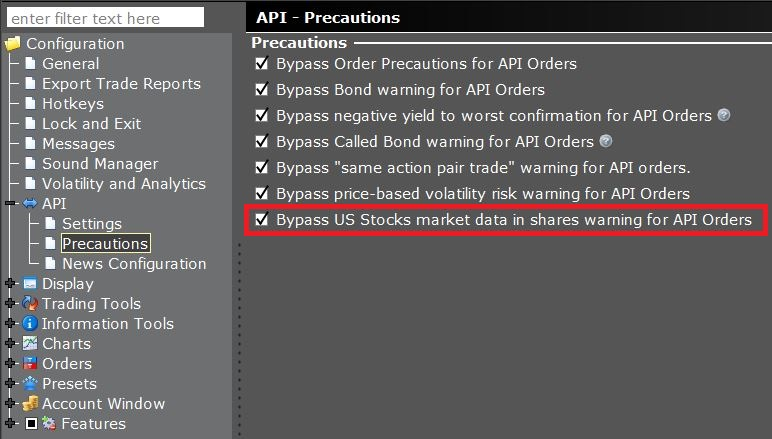

# Market Data: Live

- [Market Data: Live](#market-data-live)
  - [实时数据限制](#实时数据限制)
  - [5 Second Bars](#5-second-bars)
    - [Request Real Time Bars](#request-real-time-bars)
    - [Receive Real Time Bars](#receive-real-time-bars)
    - [Cancel Real Time Bars](#cancel-real-time-bars)
  - [Component Exchanges](#component-exchanges)
    - [Receive Component Exchanges](#receive-component-exchanges)
  - [Market Depth Exchanges](#market-depth-exchanges)
    - [Requesting Market Depth Exchanges](#requesting-market-depth-exchanges)
    - [Receive Market Depth Exchanges](#receive-market-depth-exchanges)
  - [Market Depth (L2)](#market-depth-l2)
    - [Request Market Depth](#request-market-depth)
    - [Receive Market Depth](#receive-market-depth)
    - [Cancel Market Depth](#cancel-market-depth)
  - [Options Greeks](#options-greeks)
    - [Request Options Greeks](#request-options-greeks)
    - [Calculating option prices](#calculating-option-prices)
    - [Calculating historical volatility](#calculating-historical-volatility)
    - [Receiving Options Data](#receiving-options-data)
  - [Top of Book (L1)](#top-of-book-l1)
    - [Request Watchlist Data](#request-watchlist-data)
    - [Generic Tick Types](#generic-tick-types)
    - [Streaming Data Snapshots](#streaming-data-snapshots)
    - [Regulatory Snapshots](#regulatory-snapshots)
    - [Receive Live Data](#receive-live-data)
  - [Exchange Componenet Mapping](#exchange-componenet-mapping)
  - [Re-Routing CFDs](#re-routing-cfds)
  - [Available Tick Types](#available-tick-types)
    - [Halted](#halted)
    - [Shortable](#shortable)
    - [Volume Data](#volume-data)
    - [RT Volume](#rt-volume)
    - [IB Dividends](#ib-dividends)
  - [Tick By Tick Data](#tick-by-tick-data)
    - [Request Tick By Tick Data](#request-tick-by-tick-data)
    - [Receive Tick By Tick Data](#receive-tick-by-tick-data)
    - [Cancel Tick By Tick Data](#cancel-tick-by-tick-data)
    - [Halted and Unhalted ticks](#halted-and-unhalted-ticks)


## 实时数据限制

- 对于所有数据（除了延迟的观察列表数据），通过 API 接收市场数据需要付费的数据订阅。更多信息请参见市场数据订阅页面。
- 重要提示：目前通过 API 无法获取 OSE（大阪证券交易所）的实时市场数据和历史柱状图。只能获取该交易所的 15 分钟延迟流数据。
- 报价的买价、卖价和最后成交价显示的是股数而不是手数（lots）。

API 用户可以选择配置 TWS API 以适应旧程序的兼容模式，但我们建议尽早迁移到“股数报价”。

要将报价显示为手数（lots），请在全球配置（Global Configuration）> API > 设置（Settings）页面中勾选“绕过美国股票市场数据股数警告以用于 API 订单”。

了解这些实时数据限制对于合理规划和有效利用市场数据至关重要，特别是当您需要准确的交易决策和市场分析时。确保您的交易策略和分析工具考虑到这些限制，可以帮助您更有效地操作和管理您的投资。



## 5 Second Bars

实时和历史数据功能可以通过 `EClient.reqRealTimeBars` 请求结合使用。`reqRealTimeBars` 将创建一个活跃的订阅，每五秒返回一个实时柱状图，该柱状图包含该时间段内的开盘价（O）、最高价（H）、最低价（L）和收盘价（C）值。`reqRealTimeBars` 只能与 5 秒的柱状图大小一起使用。

重要提示：实时柱状图订阅结合了顶级和历史市场数据的限制。请确保遵守市场数据行数和小柱状图（30秒或更短）的节奏违规。例如，10分钟内不能有超过60个*新*实时柱状图的请求，而且所有类型的活跃订阅总数不能超过用户允许的最大市场数据行数。

了解这些限制对于有效利用实时和历史数据功能至关重要。确保在遵守市场数据订阅的限制的同时，有效地计划和执行数据请求，可以帮助您在交易和市场分析中获得必要的信息，同时避免数据请求限制导致的潜在问题。

### Request Real Time Bars

`EClient.reqRealTimeBars` 方法用于请求实时柱状图数据。该方法的参数包括：

- `tickerId: int`：用于跟踪数据的请求标识符。
- `contract: Contract`：正在请求深度数据的合约对象。
- `barSize: int`：目前被忽略。
- `whatToShow: String`：检索数据的性质。可用值包括：TRADES, MIDPOINT, BID, ASK。
- `useRTH: int`：设置为 0 以获取在常规交易时段（RTH）之外生成的数据，设置为 1 以仅获取 RTH 数据。

此方法请求实时柱状图数据。

- 只提供 5 秒的柱状图。此请求受到与任何历史数据请求相同的节奏限制：600秒内不超过60次 API 查询。
- 实时柱状图订阅也包括在账户允许的 Level 1 市场数据订阅数量的计算中。

了解这些限制对于有效利用实时数据功能至关重要。确保在遵守市场数据订阅的限制的同时，有效地计划和执行数据请求，可以帮助您在交易和市场分析中获得必要的信息，同时避免数据请求限制导致的潜在问题。

```python
self.reqRealTimeBars(3001, contract, 5, "MIDPOINT", True, [])
```

### Receive Real Time Bars

`EWrapper.realtimeBar` 方法用于接收实时 5 秒柱状图数据。该方法的参数包括：

- `reqId: int`：用于跟踪数据的请求标识符。
- `date: long`：柱状图的日期和时间（Epoch/Unix 时间）。
- `open: double`：柱状图的开盘点。
- `high: double`：柱状图的最高点。
- `low: double`：柱状图的最低点。
- `close: double`：柱状图的收盘点。
- `volume: decimal`：柱状图的交易量（仅对于 TRADES 数据返回）。
- `WAP: decimal`：柱状图的加权平均价格，四舍五入到最小增量（仅适用于 TRADES）。
- `count: int`：柱状图时间跨度内的交易次数（仅适用于 TRADES）。

此方法在 `EClient.reqRealTimeBars` 请求发出后，提供实时的 5 秒柱状图数据。这些数据对于需要密切跟踪市场动态的交易策略或分析非常有用。通过实时柱状图数据，用户可以获得市场在极短时间内的价格动态和交易活动的即时视图。

```python
def realtimeBar(self, reqId: TickerId, time:int, open_: float, high: float, low: float, close: float, volume: Decimal, wap: Decimal, count: int):
    print("RealTimeBar. TickerId:", reqId, RealTimeBar(time, -1, open_, high, low, close, volume, wap, count))
```

### Cancel Real Time Bars

`EClient.cancelRealTimeBars` 方法用于取消实时柱状图的订阅。该方法的参数包括：

- `tickerId: int`：用于跟踪数据的请求标识符。

当您不再需要或希望停止接收通过 `EClient.reqRealTimeBars` 请求的实时柱状图数据时，可以使用 `EClient.cancelRealTimeBars` 方法来取消该订阅。这种取消功能对于管理数据流和控制数据请求非常重要，尤其是在进行高频率的数据查询或需要动态调整数据请求的情况下。通过取消不必要的订阅，可以避免不必要的数据处理，提高应用程序的效率和响应速度。

```python
self.cancelRealTimeBars(3001)
```

## Component Exchanges

API 通过单个数据请求可以接收来自多个交易所的聚合报价。用于识别报价来源的刻度类型包括 `bidExch`（刻度类型 32）、`askExch`（刻度类型 33）和 `lastExch`（刻度类型 84）。为了节省带宽，这些刻度类型返回的数据由一系列大写字母组成，而不是每个返回的交易所名称字段的长列表。为了找到在刻度类型 32、33 或 84 中返回的单个字母代码对应的完整交易所名称，可以使用 API 函数 `IBApi::EClient::reqSmartComponents`。注意：此函数只能在交易所开市时使用。

不同的 IB 合约有不同的交易所映射，包含它们交易的交易所集合。每个交易所映射有不同的代码，如 "a6" 或 "a9"。这个交易所映射代码会在用户发出市场数据请求且拥有市场数据订阅后立即返回到 `EWrapper.tickReqParams`。为了找到特定单字母代码到完整交易所名称的映射，可以使用 `reqSmartComponents` 函数，并带上返回到 `tickReqParams` 的交易所映射代码。

例如，对 IBKR US 合约的市场数据请求可能会将交易所映射标识符 "a6" 返回到 `EWrapper.tickReqParams`。使用符号 "a9" 调用 `EClient.reqSmartComponents` 函数将显示提供 IBKR US 合约市场数据的交易所列表及其单字母代码。如果 “ARCA” 的代码是 “P”，那么如果交易所刻度类型返回 “P”，则表示该报价由 ARCA 提供。

```python
self.reqSmartComponents(1018, "a6")
```

### Receive Component Exchanges

`EWrapper.smartComponents` 方法用于接收从 `IBApi::EClient::reqSmartComponents` 请求返回的智能组件数据。该方法的参数包括：

- `reqId: int`：用于跟踪数据的请求标识符。
- `smartComponentMap: SmartComponentMap`：包含所有键值对映射的独特对象。

该方法提供了一个位号到交易所及交易所缩写的字典。所有的 ID 最初可以通过 `reqTickParams` 请求获得。这个功能使得用户可以将从市场数据请求中返回的单个字母交易所代码映射到完整的交易所名称，这对于理解市场数据的来源非常重要，尤其是在处理来自多个交易所的聚合数据时。通过 `smartComponentMap`，用户可以更容易地识别和分析市场数据的具体来源，从而进行更精确的市场分析和交易决策。

```python
def smartComponents(self, reqId:int, smartComponentMap:SmartComponentMap):
    print("SmartComponents:")
        for smartComponent in smartComponentMap:
            print("SmartComponent.", smartComponent)
```

## Market Depth Exchanges

为了检查哪些交易所提供深度市场数据（Deep Book Data），可以调用 `EClient.reqMktDepthExchanges` 函数。如果用户有适当的市场数据订阅，它将返回可以提供市场深度的交易所列表。

API 中用于市场深度请求的‘Exchange’字段，如果能返回做市商信息并导致回调到 `EWrapper.updateMktDepthL2`，将在 `EWrapper.mktDepthExchanges` 字段的结果中通过 ‘isL2’ 字段的 ‘True’ 值来指示：

- `EClient.reqMktDepthExchanges` 方法用于请求能提供市场深度数据的交易所列表。
- 如果交易所支持 Level 2 市场深度数据，即更详细的市场深度信息（包括做市商的报价），则在返回的结果中 `isL2` 字段将为 ‘True’。

这种功能对于希望获取市场深度数据的交易者和分析师非常有用，尤其是对于那些需要深入了解市场供需状况的用户。通过了解哪些交易所提供深度市场数据，用户可以更有效地规划他们的市场数据请求，并根据可用的数据进行更精准的交易和分析。

### Requesting Market Depth Exchanges

EClient.reqMktDepthExchanges ()

请求将市场数据返回到 updateMktDepthL2 的场所（具有做市商的场所）。

```python
self.reqMktDepthExchanges()
```

### Receive Market Depth Exchanges

`EWrapper.mktDepthExchanges` 方法用于接收市场深度数据描述。当收到提供市场深度的所有可用交易所的信息时，此方法被调用。该方法的参数包括：

- `depthMktDataDescriptions: DepthMktDataDescription[]`：包含提供市场深度的所有可用交易所的列表。

此方法在 `EClient.reqMktDepthExchanges` 请求之后被触发，为用户提供可以访问市场深度数据的交易所信息。市场深度数据描述（Depth Market Data Descriptions）包含关于交易所的重要信息，例如是否提供 Level 2 数据（更详细的市场深度信息），以及其他相关细节。

了解可用于获取市场深度数据的交易所对于那些需要深入分析市场供需状况的交易者和分析师非常重要。这些信息可以帮助他们更好地理解市场动态，制定交易策略，并优化他们的交易决策。通过 `mktDepthExchanges` 方法提供的数据，用户可以更有效地访问和利用市场深度信息。

```python
def mktDepthExchanges(self, depthMktDataDescriptions:ListOfDepthExchanges):
    print("MktDepthExchanges:")
    for desc in depthMktDataDescriptions:
        print("DepthMktDataDescription.", desc)
```

## Market Depth (L2)

市場深度數據，也稱為Level II，代表了一個金融工具的訂單簿。通過TWS API，可以使用EClient.reqMarketDepth函數獲取此信息。與頂級市場數據（Level I）不同，市場深度數據不經過抽樣或過濾即被發送，但我們無法保證您在調用EClient.reqMarketDepth時會顯示特定安全性的每個報價。

特別是，奇數手訂單不包括在內。

可以將EClient.reqMarketDepth請求智能路由，以獲得來自所有可用交易所的匯總數據，類似於TWS BookTrader顯示的方式。

處理傳入數據的一個重要部分是監控EWrapper::error，以檢查是否出現317號消息：“市場深度數據已被重置。在應用任何新條目之前，請清空深度訂單內容。”，並適當處理它，否則更新過程將受損。

### Request Market Depth

重要提示：请注意，不同语言的 API 使用不同的方法名称来请求市场深度。

- C# 和 Visual Basic API 使用 `reqMarketDepth()`。
- Python、Java 和 C++ API 使用 `reqMktDepth()`。

`EClient.reqMarketDepth` 方法用于请求合约的市场深度（订单簿）。该方法的参数包括：

- `tickerId: int`：用于跟踪数据的请求标识符。
- `contract: Contract`：正在请求深度的合约。
- `numRows: int`：订单簿每侧的行数。
- `isSmartDepth: bool`：标志指示这是智能深度请求。
- `mktDepthOptions: List`：仅内部使用。保留为空数组。

此方法请求特定合约的市场深度（订单簿），市场深度数据提供了关于订单簿两侧（买卖）的价格和数量信息。了解市场深度对于交易者和分析师了解市场供求状况和价格动态非常重要。通过 `reqMarketDepth` 或 `reqMktDepth` 方法，用户可以获取详细的市场深度数据，以便进行更精确的市场分析和交易决策。

```python
self.reqMktDepth(2001, contract, 5, False, [])
```

### Receive Market Depth

`EWrapper.updateMktDepth` 方法用于返回订单簿的信息，仅用于直接路由的请求。该方法的参数包括：

- `tickerId: int`：用于跟踪数据的请求标识符。
- `position: int`：正在更新的订单簿行。
- `operation: int`：指示行值的变化：
  - 0 = 插入（在由 `position` 标识的行中插入这个新订单）
  - 1 = 更新（更新由 `position` 标识的行中的现有订单）
  - 2 = 删除（删除由 `position` 标识的行中的现有订单）。
- `side: int`：0 表示卖方，1 表示买方。
- `price: double`：订单的价格。
- `size: decimal`：订单的大小。

当通过 `EClient.reqMarketDepth` 或 `EClient.reqMktDepth` 请求市场深度数据时，`updateMktDepth` 方法被用于接收和返回订单簿的更新信息。此方法提供了订单簿中每行的详细信息，包括价格、大小以及操作类型（插入、更新或删除）。了解这些信息对于交易者和分析师深入了解市场供求状况和制定交易策略非常重要。通过实时更新的订单簿数据，用户可以更准确地捕捉市场动态和交易机会。

```python
def updateMktDepth(self, reqId: TickerId, position: int, operation: int, side: int, price: float, size: Decimal):
    print("UpdateMarketDepth. ReqId:", reqId, "Position:", position, "Operation:", operation, "Side:", side, "Price:", floatMaxString(price), "Size:", decimalMaxString(size))
```

-----

`EWrapper.updateMktDepthL2` 方法用于返回 Level 2 订单簿信息，仅用于直接路由的请求。该方法的参数包括：

- `tickerId: int`：用于跟踪数据的请求标识符。
- `position: int`：正在更新的订单簿行。
- `marketMaker: String`：如果 `isSmartDepth` 为 True，则为持有订单的交易所；否则为做市商的 MPID。
- `operation: int`：指示行值的变化：
  - 0 = 插入（在由 `position` 标识的行中插入这个新订单）
  - 1 = 更新（更新由 `position` 标识的行中的现有订单）
  - 2 = 删除（删除由 `position` 标识的行中的现有订单）。
- `side: int`：0 表示卖方，1 表示买方。
- `price: double`：订单的价格。
- `size: decimal`：订单的大小。
- `isSmartDepth: bool`：标志指示这是否为智能深度响应。

当通过 `EClient.reqMarketDepth` 或 `EClient.reqMktDepth` 请求市场深度数据时，如果订阅了 Level 2 数据，`updateMktDepthL2` 方法被用于接收和返回订单簿的更新信息。此方法提供了 Level 2 订单簿中每行的详细信息，包括价格、大小、操作类型（插入、更新或删除）以及做市商或交易所信息。Level 2 数据提供了市场深度的更详细视图，对于交易者和分析师来说，这些信息对于深入了解市场供求状况和制定交易策略非常有价值。通过实时更新的 Level 2 订单簿数据，用户可以更准确地捕捉市场动态和交易机会。

```python
def updateMktDepthL2(self, reqId: TickerId, position: int, marketMaker: str, operation: int, side: int, price: float, size: Decimal, isSmartDepth: bool):
  print("UpdateMarketDepthL2. ReqId:", reqId, "Position:", position, "MarketMaker:", marketMaker, "Operation:", operation, "Side:", side, "Price:", floatMaxString(price), "Size:", decimalMaxString(size), "isSmartDepth:", isSmartDepth)
```

### Cancel Market Depth

`EClient.cancelMarketDepth` 方法用于取消市场深度数据的请求。该方法的参数包括：

- `tickerId: int`：用于跟踪数据的请求标识符。
- `isSmartDepth: bool`：标志指示这是否为智能深度请求。

当您不再需要或希望停止接收通过 `EClient.reqMarketDepth` 或 `EClient.reqMktDepth` 请求的市场深度数据时，可以使用 `EClient.cancelMarketDepth` 方法来取消该请求。这种取消功能对于管理数据流和控制数据请求非常重要，尤其是在进行高频率的数据查询或需要动态调整数据请求的情况下。通过取消不必要的市场深度请求，可以避免不必要的数据处理，提高应用程序的效率和响应速度。

```python
self.cancelMktDepth(2001, False)
```

## Options Greeks

期权希腊字母值（如 Delta、Gamma、Theta、Vega）在对期权发出 `reqMktData()` 请求后，默认返回。请参阅可用的刻度类型。

刻度类型“买入期权计算”（#10）、“卖出期权计算”（#11）、“最后期权计算”（#12）和“模型期权计算”（#13）在请求时返回所有希腊字母值（Delta、Gamma、Vega、Theta）、标的价格以及股票和期权参考价格。

`MODEL_OPTION_COMPUTATION` 还返回模型隐含波动率。

请注意，要接收实时希腊字母值，需要同时拥有期权和其标的合约的市场数据订阅。

给定期权价格和标的价格，可以使用 `EClient.calculateImpliedVolatility` 函数计算期权的隐含波动率。

另外，给定标的价格和一个隐含波动率，可以使用 `EClient.calculateOptionPrice` 函数计算期权价格。

在请求之后，特定于期权的信息将通过 `EWrapper.tickOptionComputation` 方法传递。

这些功能对于交易和分析期权非常重要，因为它们提供了关于期权定价和市场预期的重要信息。了解期权的希腊字母值和隐含波动率对于评估期权的风险和潜在盈利性至关重要，同时也有助于更好地理解市场动态和制定交易策略。通过计算隐含波动率和期权价格，用户可以进行更深入的期权分析和评估。

### Request Options Greeks

`EClient.reqMktData` 方法用于请求市场数据。该方法的参数包括：

- `reqId: int`：用于跟踪数据的请求标识符。
- `contract: Contract`：用于指定工具的合约对象。
- `genericTickList: String`：可用通用刻度的逗号分隔 ID 列表。
- `snapshot: bool`：设置为 True 以获取具有相关订阅的快照数据，或设置为 False 以获取实时数据。
- `regulatorySnapshot: bool`：设置为 True 以获取付费的监管快照，或设置为 False 以获取实时数据。
- `mktDataOptions: List<TagValue>`：仅内部使用。

只要数据是在期权合约上请求的，如果已经订阅了标的市场数据，希腊字母值将自动被请求。这意味着当您对某个期权合约发起市场数据请求时，如果您已经订阅了该期权的标的资产的市场数据，那么期权的希腊字母值（如 Delta、Gamma、Theta、Vega）将自动包含在返回的数据中。

这种功能对于那些需要进行期权交易和分析的用户来说非常有用，因为它允许他们访问期权的核心定价参数和市场预期指标。了解和监控这些指标对于评估期权策略、管理风险和优化交易决策至关重要。


```python
self.reqMktData(reqId, OptionContract, "", False, False, [])
```

### Calculating option prices

`EClient.calculateOptionPrice` 方法用于根据提供的波动率和其标的价格计算期权价格。该方法的参数包括：

- `reqId: int`：用于跟踪数据的请求标识符。
- `contract: Contract`：正在请求深度的合约对象。
- `volatility: double`：假设的波动率。
- `underPrice: double`：假设的期权标的价格。
- `optionPriceOptions: List<TagValue>`：仅内部使用。发送空的标签值列表。

此方法允许用户根据特定的波动率和标的价格来估算期权的理论价格。这对于期权交易者和分析师来说非常有用，因为它可以帮助他们评估不同市场情况下的期权价值，以及在特定波动率假设下期权的潜在表现。

通过使用 `calculateOptionPrice` 方法，用户可以更好地理解期权价格与波动率和标的价格之间的关系，从而进行更精确的交易策略规划和风险管理。这对于期权交易的决策过程和对不同市场情况的适应性至关重要。

```python
self.calculateImpliedVolatility(5001, OptionContract, 0.5, 55, [])
```

### Calculating historical volatility

`EClient.calculateImpliedVolatility` 方法用于计算期权的隐含波动率。这是基于假设的期权价格和其标的价格来请求计算隐含波动率。该方法的参数包括：

- `reqId: int`：用于跟踪数据的请求标识符。
- `contract: Contract`：正在请求深度的合约对象。
- `optionPrice: double`：假设的期权价格。
- `underPrice: double`：假设的期权标的价格。
- `impliedVolatilityOptions: List<TagValue>`：仅内部使用。发送空的标签值列表。

此方法允许用户估算在特定期权价格和标的价格下的期权隐含波动率。隐含波动率是市场对期权未来波动性的预期，它是期权定价的关键因素之一。

通过使用 `calculateImpliedVolatility` 方法，用户可以更好地理解市场对期权未来波动性的预期，这对于期权策略的制定和风险管理至关重要。了解隐含波动率对于评估期权价格的合理性、预测市场动态以及进行敏感性分析非常有价值。这种能力特别对于那些需要评估不同波动性情景下期权表现的交易者和分析师来说非常重要。

### Receiving Options Data

`EWrapper.tickOptionComputation` 方法用于接收特定于期权的市场数据。当期权或其标的市场发生变动时，此方法被调用。该方法的参数包括：

- `tickerId`：请求的唯一标识符。
- `field: int`：指定期权计算的类型。将字段值传入 `TickType.getField(int tickType)` 以检索字段描述。例如，字段值 13 将映射到 modelOptComp 等。10 = Bid 11 = Ask 12 = Last。
- `tickAttrib: int`：0 - 返回基于，1 - 价格基于。
- `impliedVolatility: double`：由 TWS 期权模型计算的隐含波动率，使用指定的刻度类型值。
- `delta: double`：期权的 Delta 值。
- `optPrice: double`：期权价格。
- `pvDividend: double`：期权标的预期股息的现值。
- `gamma: double`：期权的 Gamma 值。
- `vega: double`：期权的 Vega 值。
- `theta: double`：期权的 Theta 值。
- `undPrice: double`：标的的价格。

此方法在期权或其标的的市场发生变动时接收期权特定的市场数据。通过 TWS 的期权模型接收到的隐含波动率、价格和 Delta 值，以及期权标的预期股息的现值。这些信息对于期权交易者和分析师来说非常重要，因为它们提供了关于期权定价和市场预期的关键信息。了解这些指标对于评估期权策略、管理风险和优化交易决策至关重要。

```python
def tickOptionComputation(self, reqId: TickerId, tickType: TickType, tickAttrib: int, impliedVol: float, delta: float, optPrice: float, pvDividend: float, gamma: float, vega: float, theta: float, undPrice: float):
    print("TickOptionComputation. TickerId:", reqId, "TickType:", tickType, "TickAttrib:", intMaxString(tickAttrib), "ImpliedVolatility:", floatMaxString(impliedVol), "Delta:", floatMaxString(delta), "OptionPrice:", floatMaxString(optPrice), "pvDividend:", floatMaxString(pvDividend), "Gamma: ", floatMaxString(gamma), "Vega:", floatMaxString(vega), "Theta:", floatMaxString(theta), "UnderlyingPrice:", floatMaxString(undPrice))
```

## Top of Book (L1)

通过 `EClient.reqMktData` 方法，您可以请求流式市场数据，这些数据对应于 TWS 观察列表中显示的数据。此数据不是逐笔的，而是由每秒几次的聚合快照组成。通过调用 `EClient.reqMktData` 默认返回一组“默认”刻度类型，通过在市场数据请求中指定相应的通用刻度类型，可以获得额外的刻度类型。通过包含通用刻度类型，可以获得许多（但不是全部）可以通过在 TWS 观察列表中添加额外列来显示的数据类型。

使用 TWS API，您可以请求实时市场数据以进行交易和分析。来自 API 的市场数据，由 `IBApi.EClient.reqMktData` 函数返回，对应于 TWS 观察列表中显示的市场数据。这些数据不是逐笔的，而是由在不同类型的工具上不同的秒内间隔拍摄的聚合快照组成：

- 股票和期权：数据更新可能更频繁。
- 固定收益产品和外汇：数据更新可能较少频繁。

这种数据对于进行实时市场分析和制定交易策略非常有用。通过访问聚合的实时市场数据，用户可以获得关于市场价格、成交量和其他关键指标的即时信息。这种实时数据对于那些需要快速反应市场变化的交易者尤其重要。

| Product                    | Frequency |
| -------------------------- | --------- |
| Stocks, Futures and others | 250 ms    |
| US Options                 | 100 ms    |
| FX pairs                   | 5 ms      |

### Request Watchlist Data

`EClient.reqMktData` 方法用于请求实时市场数据。该方法的参数包括：

- `reqId: int`：用于跟踪数据的请求标识符。
- `contract: Contract`：用于指定工具的合约对象。
- `genericTickList: String`：可用通用刻度的逗号分隔 ID 列表。
- `snapshot: bool`：用于检索单个数据快照，适用于那些已有市场数据订阅的用户。
- `regulatorySnapshot: bool`：用于检索单个付费数据快照。每个快照的成本为 $0.01。
- `mktDataOptions: List<TagValue>`：仅内部使用。

此方法请求特定工具的实时市场数据。返回的市场数据可以是实时的，也可以是延迟 10-15 分钟的数据。通过 `reqMktData` 方法，用户可以获得关于股票、期权、固定收益产品和外汇等多种金融工具的市场数据，包括价格、成交量和其他关键市场指标。

这些实时或稍有延迟的市场数据对于进行交易决策、市场分析和风险管理非常重要。了解市场动态和及时获取关键市场数据对于制定有效的交易策略和应对市场变化至关重要。通过 `reqMktData` 方法提供的市场数据，用户可以在交易和分析过程中拥有准确和及时的市场信息。

```python
self.reqMktData(reqId, contract, "", False, False, [])
```

### Generic Tick Types

在成功的市场数据请求后，最常见的刻度类型会自动传送。然而，还有其他刻度类型可以通过显式请求获得：这些是通用刻度类型。当调用 `IBApi.EClient.reqMktData` 时，可以通过该函数的 `genericTickList` 参数请求特定的通用刻度：

- `genericTickList: String`：这个参数是一个逗号分隔的 ID 列表，用于指定您希望接收的通用刻度类型。每种类型代表一种特定的市场数据，例如交易量、最新交易价格、买卖盘深度等。

有关通用刻度的更多信息，可以参见可用刻度类型部分。不同的通用刻度类型提供了关于金融工具不同方面的市场数据，使用户可以根据自己的需要定制市场数据的请求。这对于需要特定市场信息以进行精准分析和交易决策的用户来说非常有用。

通过明确指定通用刻度类型，用户可以获取超出默认市场数据提供的详细信息，从而获得更全面的市场视角和更深入的分析。

### Streaming Data Snapshots

拥有交易所市场数据订阅（例如美国股票的 Network A (NYSE)、Network B (ARCA) 或 Network C (NASDAQ)）后，您可以请求市场当前状态的快照，而不是持续请求随市场价值变化的实时更新流。通过调用 `EClient.reqMktData` 函数，并为 snapshot 参数传入 true，客户端应用程序将接收一次当前可用的市场数据，然后在 11 秒后发送 `EWrapper.tickSnapshotEnd` 事件以表示快照接收结束。快照请求只能针对默认刻度类型；无法指定通用刻度。需要注意的是，快照请求只会在 11 秒时间跨度内返回可用数据；在某些情况下，可能不会为所有刻度类型返回值。

`EWrapper.tickSnapshotEnd` 方法的参数包括：

- `tickerId: int`：用于跟踪数据的请求标识符。

当请求市场数据快照时，此方法会指示快照接收已完成。预计在请求开始后的 11 秒发生。

市场数据快照请求是一个有效的工具，用于获取市场的一次性视图，而不是持续的数据流。这对于需要对市场进行快速评估的用户来说尤其有用，例如在做出交易决策之前快速检查市场状况。通过使用快照功能，用户可以在不增加过多数据流量的情况下获得关键的市场信息。

```python
def tickSnapshotEnd(self, reqId: int):
    print("TickSnapshotEnd. TickerId:", reqId)
```

### Regulatory Snapshots

`reqMktData` 函数的第五个参数用于指定对美国股票和期权的监管快照请求。

对于股票，需要单独的特定交易所市场数据订阅才能接收流式报价。例如，对于纽约证券交易所（NYSE）股票，这种订阅被称为“Network A”，对于 ARCA/AMEX 股票，称为“Network B”，对于纳斯达克（NASDAQ）股票，称为“Network C”。每个订阅都是单独添加的，并且有单独的市场数据费用。

另外，还有一个“美国证券快照捆绑包”（US Securities Snapshot Bundle）订阅，它不提供流式数据，但允许实时计算美国市场 NBBO 价格的快照。通过在 `EClient::reqMktData` 函数中将第五个参数设置为 True，可以从 API 发起监管快照请求。返回的值是基于所有可用交易所数据计算得出的当前市场状态。

重要提示：每个监管快照请求将向账户收取 0.01 美元的费用。这适用于实时和模拟账户。如果监管快照的月费用达到特定“网络”订阅的价格，用户将自动订阅该网络的持续流式报价，并在当月支付相关费用。月底订阅将被终止。每个上市交易所的费用上限将单独计算，不会跨上市交易所合并。

请求监管快照受到节奏限制：

- 每秒不超过一个请求。
- 下表列出了监管快照报价的成本和最大分配：

| Listed Network Feed    | Price per reqSnapshot request | Pro or non-Pro | Max reqSnapshot request |
| ---------------------- | ----------------------------- | -------------- | ----------------------- |
| NYSE (Network A/CTA)   | 0.01 USD                      | Pro            | 4500                    |
| NYSE (Network A/CTA)   | 0.01 USD                      | Non-Pro        | 150                     |
| AMEX (Network B/CTA)   | 0.01 USD                      | Pro            | 2300                    |
| AMEX (Network B/CTA)   | 0.01 USD                      | Non-Pro        | 150                     |
| NASDAQ (Network C/UTP) | 0.01 USD                      | Pro            | 2300                    |
| NASDAQ (Network C/UTP) | 0.01 USD                      | Non-Pro        | 150                     |

### Receive Live Data

`EWrapper.tickGeneric` 方法用于返回通用数据给请求者。当接收到多种类型的刻度时使用，用于表示一般的评估。该方法的参数包括：

- `tickerId: int`：用于跟踪数据的请求标识符。
- `field: int`：正在接收的刻度类型。
- `value: double`：对应于值的返回值。更多细节请参见可用刻度类型。

`tickGeneric` 方法用于返回一系列刻度类型的数据，通常用于传达股票、期权、固定收益产品和外汇等多种金融工具的一般市场信息。这些信息可能包括但不限于价格变动、交易量、交易次数等。

了解通用刻度数据对于进行市场分析和制定交易策略至关重要，因为它们提供了关于市场动态和工具行为的关键信息。通过 `tickGeneric` 方法提供的数据，用户可以在交易和分析过程中获得关于市场的广泛和多样化的见解。

```python
def tickGeneric(self, reqId: TickerId, tickType: TickType, value: float):
    print("TickGeneric. TickerId:", reqId, "TickType:", tickType, "Value:", floatMaxString(value))
```

----

`EWrapper.tickPrice` 方法用于处理所有与价格相关的市场数据刻度。当接收到价格相关的市场数据时调用。该方法的参数包括：

- `tickerId: int`：用于跟踪数据的请求标识符。
- `field: int`：正在接收的价格类型（例如，卖出价）。
- `price: double`：实际价格。
- `attribs: TickAttrib`：包含价格属性的 `TickAttrib` 对象，例如 `TickAttrib::CanAutoExecute`（是否可以自动执行）、`TickAttrib::PastLimit`（是否超过限制）和 `TickAttrib::PreOpen`（是否在开盘前）。

市场数据刻度价格回调处理所有与价格相关的刻度。每个 `tickPrice` 回调后面都会跟一个 `tickSize`。`tickPrice` 值为 -1 或 0 且后面跟着的 `tickSize` 为 0 表示目前此字段没有可用数据，而 `tickPrice` 值为正且 `tickSize` 为正表示 0 的活跃报价（通常用于组合合约）。

了解 `tickPrice` 方法返回的市场数据对于进行实时市场分析和制定交易决策非常重要。它提供了关于市场价格动态的即时信息，这对于需要快速响应市场变化的交易者尤其重要。通过监控不同类型的价格刻度，用户可以更好地理解市场行为并做出更有效的交易策略。

```python
def tickPrice(self, reqId: TickerId, tickType: TickType, price: float, attrib: TickAttrib):
    print(reqId, tickType, price, attrib)
```

----

`EWrapper.tickSize` 方法用于处理所有与大小相关的市场数据刻度。当接收到大小相关的市场数据时调用。该方法的参数包括：

- `tickerId: int`：用于跟踪数据的请求标识符。
- `field: int`：正在接收的大小类型（例如，买入大小）。
- `size: int`：实际大小。美国股票的乘数为 100。

市场数据刻度大小回调处理所有与大小相关的刻度。这些刻度提供了关于市场订单量的信息，例如买单或卖单的数量。了解这些信息对于评估市场的供需状况和进行交易决策非常重要。

通过监控不同类型的大小刻度，用户可以更好地理解市场的流动性和参与度。例如，较大的买入或卖出大小可能表明市场上有较强的买方或卖方兴趣。这些数据对于进行市场分析、制定交易策略和管理交易风险至关重要。通过 `tickSize` 方法提供的数据，用户可以获得市场行为的更深入洞察，以便做出更明智的交易决策。

```python
def tickSize(self, reqId: TickerId, tickType: TickType, size: Decimal):
    print("TickSize. TickerId:", reqId, "TickType:", tickType, "Size: ", decimalMaxString(size))
```

----

`EWrapper.tickString` 方法是市场数据回调，用于处理接收到的字符串类型的市场数据刻度。该方法的参数包括：

- `tickerId: int`：用于跟踪数据的请求标识符。
- `field: int`：正在接收的刻度类型。
- `value: String`：包含消息响应的变量。

市场数据回调中，每个 `tickPrice` 后面都会跟随一个 `tickSize`。每当 `tickSize` 发生变化时，也会有独立的 `tickSize` 回调，因此在 `tickPrice` 后会有重复的 `tickSize` 消息。`tickString` 方法用于接收特定类型的市场数据，例如交易时间、最后交易价、成交量等，这些信息通常以字符串格式提供。

了解 `tickString` 方法返回的市场数据对于进行实时市场分析和制定交易策略非常重要。这些数据提供了关于市场行为和交易动态的额外维度，有助于用户更全面地理解市场情况。通过监控这些字符串类型的刻度，用户可以获得关于市场的更多信息，从而做出更加明智和信息充分的交易决策。


```python
def tickString(self, reqId: TickerId, tickType: TickType, value: str):
    print("TickString. TickerId:", reqId, "Type:", tickType, "Value:", value)
```

## Exchange Componenet Mapping

市场数据请求能够从多个交易所返回数据。在对受市场数据订阅覆盖的工具发出市场数据请求后，将向函数 `IBApi::EWrapper::tickReqParams` 发送消息，其中包含关于‘minTick’（最小变动价位）、BBO交易所映射和可用快照权限的信息。

交易所映射标识符 `bboExchange` 将是如 “a6” 这样的符号，可用于解码返回到 `bidExch`、`askExch` 和 `lastExch` 字段的单字母交易所缩写，方法是调用 `IBApi::EClient::reqSmartComponents` 函数。有关组件交易所的更多信息。

返回到 `tickReqParams` 的 `minTick` 指示返回到 API 的市场数据值的最小增量。它可能与 `ContractDetails` 类中的 `minTick` 值不同。例如，组合合约的市场数据通常有 0.01 的最小增量，而订单下单的 `minTick` 为 0.05。

了解 `tickReqParams` 提供的 `minTick` 和交易所映射信息对于进行市场数据分析和交易决策非常重要。`minTick` 信息有助于用户了解市场数据的精度，而交易所映射信息有助于用户识别报价的来源。这些数据对于准确理解市场行为和适当地制定交易策略至关重要。通过使用 `reqSmartComponents` 方法，用户可以获取更详细的交易所信息，以便更全面地分析市场动态。

`EWrapper.tickReqParams` 方法用于显示具有最佳买卖报价（BBO）交易所的股票信息。当市场数据请求发出后，此方法提供相关的附加信息。该方法的参数包括：

- `tickerId: int`：用于跟踪数据的请求标识符。
- `minTick: double`：交易所上该合约的最小变动价位。
- `bboExchange: String`：提供最佳买卖报价的交易所。
- `snapshotPermissions: int`：基于 `EClient.reqMktData` 中的 snapshot 参数。

此方法在市场数据请求发出后被调用，提供关于请求的合约的最小变动价位、提供最佳买卖报价的交易所，以及是否有权限获取数据快照的信息。这些信息对于理解市场数据的精度和来源非常重要。

了解 `tickReqParams` 方法返回的 `minTick` 和 `bboExchange` 信息对于精确地评估市场行为和制定交易策略至关重要。例如，了解最小变动价位有助于用户进行精确的价格分析和下单，而了解提供最佳报价的交易所有助于识别市场的主要参与者。此外，`snapshotPermissions` 信息表明用户是否有权限获取该合约的实时数据快照，这对于进行快速市场分析和决策非常有用。

```python
def tickReqParams(self, tickerId:int, minTick:float, bboExchange:str, snapshotPermissions:int):
    print("TickReqParams. TickerId:", tickerId, "MinTick:", 
        floatMaxString(minTick), "BboExchange:", bboExchange, "SnapshotPermissions:", 
        intMaxString(snapshotPermissions))
```

## Re-Routing CFDs

Interactive Brokers (IB) 不提供某些类型工具的市场数据，例如股票差价合约（CFD）和外汇差价合约（Forex CFD）。如果在 TWS 观察列表中输入了股票 CFD 或外汇 CFD，TWS 会自动显示其标的股票的市场数据，并在工具名称旁显示一个 ‘U’ 图标，表明该数据是针对标的工具的。

从 API 方面来看，当请求股票 CFD 或外汇 CFD 的 1 级（Level 1）或 2 级（Level 2）市场数据时，会分别向 `EWrapper.rerouteMktDataReq` 或 `EWrapper.rerouteMktDepthReq` 函数回调，提供有关 IB 数据库中具有市场数据的标的工具的详细信息。

- `EWrapper.rerouteMktDataReq` 用于处理 1 级市场数据请求的重新路由。
- `EWrapper.rerouteMktDepthReq` 用于处理 2 级市场深度数据请求的重新路由。

这些功能使用户能够间接获取到差价合约的相关市场信息，尽管 IB 直接不提供这些差价合约的市场数据。通过这种方式，用户可以更好地理解和分析差价合约标的资产的市场动态，从而进行更有根据的交易和投资决策。这一机制对于希望通过 API 跟踪和分析股票 CFD 或外汇 CFD 市场动态的用户来说非常有用。

`EWrapper.rerouteMktDataReq` 方法用于返回 CFD 市场数据请求重定向的合约标识符（conId）和交易所信息。当对差价合约（CFD）请求市场数据时，此方法提供了具有市场数据的标的工具的相关信息。该方法的参数包括：

- `reqId: int`：用于跟踪数据的请求标识符。
- `conId: int`：具有市场数据的标的工具的合约标识符。
- `exchange: String`：标的工具的主要交易所。

当通过 API 对股票 CFD 或外汇 CFD 请求市场数据时，由于 IB 不直接提供这些差价合约的市场数据，`rerouteMktDataReq` 方法就被用来提供标的工具（即差价合约所基于的资产）的合约标识符和交易所信息。这样，用户可以获取到标的资产的市场数据，从而间接获得有关差价合约的市场信息。

这种方法对于那些需要了解差价合约标的资产市场动态的用户来说是非常有价值的，因为它使他们能够更好地理解和分析市场情况，进而对差价合约做出更有根据的交易和投资决策。通过了解标的资产的市场数据，用户可以更准确地评估差价合约的潜在风险和机会。

```python
def rerouteMktDataReq(self, reqId: int, conId: int, exchange: str):
    print("Re-route market data request. ReqId:", reqId, "ConId:", conId, "Exchange:", exchange)
```

----

`EWrapper.rerouteMktDepthReq` 方法用于在对没有数据的工具（例如股票差价合约和指数差价合约）请求 2 级数据时，返回标的合约的合约标识符（conId）和交易所信息。当通过 API 请求这些工具的市场深度数据时，如果 Interactive Brokers (IB) 的数据库中没有这些数据，就会使用这种方法。该方法的参数包括：

- `reqId: int`：用于跟踪数据的请求标识符。
- `conId: int`：具有市场数据的标的工具的合约标识符。
- `exchange: String`：标的工具的主要交易所。

当用户尝试通过 API 请求不存在于 IB 数据库中的工具（如股票 CFD 或指数 CFD）的市场深度（Level 2）数据时，`rerouteMktDepthReq` 方法就会被调用。此方法提供了具有市场数据的标的工具的合约标识符和交易所信息，允许用户间接地获取有关这些工具的市场深度信息。

这种方法对于那些需要深入了解差价合约标的资产的市场深度情况的用户来说非常有用。通过了解标的资产的市场深度数据，用户可以更好地理解市场的供求状况，进而对差价合约做出更明智的交易决策。这对于评估市场流动性和执行复杂的交易策略尤为重要。

```python
def rerouteMktDepthReq(self, reqId: int, conId: int, exchange: str):
    print("Re-route market depth request. ReqId:", reqId, "ConId:", conId, "Exchange:", exchange)
```

## Available Tick Types

`EClient.reqMktData` 将数据返回到多个方法，例如 `EWrapper.tickPrice`、`EWrapper.tickSize`、`EWrapper.tickString` 等。返回的值取决于请求的通用刻度和返回的数据类型。以下表格列出了应该请求哪个通用刻度，应该返回哪个刻度 ID，以及数据将返回到哪个方法。

- **通用刻度（Generic Tick）**：指定要请求的特定类型的市场数据。
- **刻度 ID（Tick ID）**：市场数据的唯一标识符，用于跟踪特定数据类型。
- **返回方法（Return Method）**：接收相应市场数据的 `EWrapper` 接口中的方法。

例如，如果您请求特定的通用刻度，如最新成交价格或成交量，`reqMktData` 将相应的数据发送到相应的 `EWrapper` 方法。例如，价格数据可能会发送到 `tickPrice` 方法，大小数据可能会发送到 `tickSize` 方法，而其他类型的字符串数据可能会发送到 `tickString` 方法。

了解这些关联对于正确处理和解释通过 TWS API 接收的市场数据非常重要。这使得用户可以根据需要定制其市场数据请求，并准确地处理接收到的数据，以便在交易决策和市场分析中使用这些信息。

| Tick Name                    | Description                                                                                                                                                                                                                                                                     | Generic Tick | Delivery Method                      | Tick Id |
| ---------------------------- | ------------------------------------------------------------------------------------------------------------------------------------------------------------------------------------------------------------------------------------------------------------------------------- | ------------ | ------------------------------------ | ------- |
| Bid Size                     | Number of contracts or lots offered at the bid price.                                                                                                                                                                                                                           | –            | IBApi.EWrapper.tickSize              | 0       |
| Bid Price                    | Highest priced bid for the contract.                                                                                                                                                                                                                                            | –            | IBApi.EWrapper.tickPrice             | 1       |
| Ask Price                    | Lowest price offer on the contract.                                                                                                                                                                                                                                             | –            | IBApi.EWrapper.tickPrice             | 2       |
| Ask Size                     | Number of contracts or lots offered at the ask price.                                                                                                                                                                                                                           | –            | IBApi.EWrapper.tickSize              | 3       |
| Last Price                   | Last price at which the contract traded (does not include some trades in RTVolume).                                                                                                                                                                                             | –            | IBApi.EWrapper.tickPrice             | 4       |
| Last Size                    | Number of contracts or lots traded at the last price.                                                                                                                                                                                                                           | –            | IBApi.EWrapper.tickSize              | 5       |
| High                         | High price for the day.                                                                                                                                                                                                                                                         | –            | IBApi.EWrapper.tickPrice             | 6       |
| Low                          | Low price for the day.                                                                                                                                                                                                                                                          | –            | IBApi.EWrapper.tickPrice             | 7       |
| Volume                       | Trading volume for the day for the selected contract (US Stocks: multiplier 100).                                                                                                                                                                                               | –            | IBApi.EWrapper.tickSize              | 8       |
| Close Price                  | “The last available closing price for the previous day. For US Equities we use corporate action processing to get the closing price so the close price is adjusted to reflect forward and reverse splits and cash and stock dividends.”                                         | –            | IBApi.EWrapper.tickPrice             | 9       |
| Bid Option Computation       | Computed Greeks and implied volatility based on the underlying stock price and the option bid price. See Option Greeks                                                                                                                                                          | –            | IBApi.EWrapper.tickOptionComputation | 10      |
| Ask Option Computation       | Computed Greeks and implied volatility based on the underlying stock price and the option ask price. See Option Greeks                                                                                                                                                          | –            | IBApi.EWrapper.tickOptionComputation | 11      |
| Last Option Computation      | Computed Greeks and implied volatility based on the underlying stock price and the option last traded price. See Option Greeks                                                                                                                                                  | –            | IBApi.EWrapper.tickOptionComputation | 12      |
| Model Option Computation     | Computed Greeks and implied volatility based on the underlying stock price and the option model price. Correspond to greeks shown in TWS. See Option Greeks                                                                                                                     | –            | IBApi.EWrapper.tickOptionComputation | 13      |
| Open Tick                    | Current session’s opening price. Before open will refer to previous day. The official opening price requires a market data subscription to the native exchange of the instrument.                                                                                               | –            | IBApi.EWrapper.tickPrice             | 14      |
| Low 13 Weeks                 | Lowest price for the last 13 weeks. For stocks only.                                                                                                                                                                                                                            | 165          | IBApi.EWrapper.tickPrice             | 15      |
| High 13 Weeks                | Highest price for the last 13 weeks. For stocks only.                                                                                                                                                                                                                           | 165          | IBApi.EWrapper.tickPrice             | 16      |
| Low 26 Weeks                 | Lowest price for the last 26 weeks. For stocks only.                                                                                                                                                                                                                            | 165          | IBApi.EWrapper.tickPrice             | 17      |
| High 26 Weeks                | Highest price for the last 26 weeks. For stocks only.                                                                                                                                                                                                                           | 165          | IBApi.EWrapper.tickPrice             | 18      |
| Low 52 Weeks                 | Lowest price for the last 52 weeks. For stocks only.                                                                                                                                                                                                                            | 165          | IBApi.EWrapper.tickPrice             | 19      |
| High 52 Weeks                | Highest price for the last 52 weeks. For stocks only.                                                                                                                                                                                                                           | 165          | IBApi.EWrapper.tickPrice             | 20      |
| Average Volume               | The average daily trading volume over 90 days. Multiplier of 100. For stocks only.                                                                                                                                                                                              | 165          | IBApi.EWrapper.tickSize              | 21      |
| Open Interest                | “(Deprecated not currently in use) Total number of options that are not closed.”                                                                                                                                                                                                | –            | IBApi.EWrapper.tickSize              | 22      |
| Option Historical Volatility | The 30-day historical volatility (currently for stocks).                                                                                                                                                                                                                        | 104          | IBApi.EWrapper.tickGeneric           | 23      |
| Option Implied Volatility    | “A prediction of how volatile an underlying will be in the future. The IB 30-day volatility is the at-market volatility estimated for a maturity thirty calendar days forward of the current trading day and is based on option prices from two consecutive expiration months.” | 106          | IBApi.EWrapper.tickGeneric           | 24      |
| Option Bid Exchange          | Not Used.                                                                                                                                                                                                                                                                       | –            | IBApi.EWrapper.tickString            | 25      |
| Option Ask Exchange          | Not Used.                                                                                                                                                                                                                                                                       | –            | IBApi.EWrapper.tickString            | 26      |
| Option Call Open Interest    | Call option open interest.                                                                                                                                                                                                                                                      | 101          | IBApi.EWrapper.tickSize              | 27      |
| Option Put Open Interest     | Put option open interest.                                                                                                                                                                                                                                                       | 101          | IBApi.EWrapper.tickSize              | 28      |
| Option Call Volume           | Call option volume for the trading day.                                                                                                                                                                                                                                         | 100          | IBApi.EWrapper.tickSize              | 29      |
| Option Put Volume            | Put option volume for the trading day.                                                                                                                                                                                                                                          | 100          | IBApi.EWrapper.tickSize              | 30      |
| Index Future Premium         | The number of points that the index is over the cash index.                                                                                                                                                                                                                     | 162          | IBApi.EWrapper.tickGeneric           | 31      |
| Bid Exchange                 | “For stock and options identifies the exchange(s) posting the bid price. See Component Exchanges”                                                                                                                                                                               | –            | IBApi.EWrapper.tickString            | 32      |
| Ask Exchange                 | “For stock and options identifies the exchange(s) posting the ask price. See Component Exchanges”                                                                                                                                                                               | –            | IBApi.EWrapper.tickString            | 33      |
| Auction Volume               | The number of shares that would trade if no new orders were received and the auction were held now.                                                                                                                                                                             | 225          | IBApi.EWrapper.tickSize              | 34      |
| Auction Price                | The price at which the auction would occur if no new orders were received and the auction were held now- the indicative price for the auction. Typically received after Auction imbalance (tick type 36)                                                                        | 225          | IBApi.EWrapper.tickPrice             | 35      |
| Auction Imbalance            | The number of unmatched shares for the next auction; returns how many more shares are on one side of the auction than the other. Typically received after Auction Volume (tick type 34)                                                                                         | 225          | IBApi.EWrapper.tickSize              | 36      |
| Mark Price                   | “The mark price is the current theoretical calculated value of an instrument. Since it is a calculated value it will typically have many digits of precision.”                                                                                                                  | 232          | IBApi.EWrapper.tickPrice             | 37      |
| Bid EFP Computation          | Computed EFP bid price                                                                                                                                                                                                                                                          | –            | IBApi.EWrapper.tickEFP               | 38      |
| Ask EFP Computation          | Computed EFP ask price                                                                                                                                                                                                                                                          | –            | IBApi.EWrapper.tickEFP               | 39      |
| Last EFP Computation         | Computed EFP last price                                                                                                                                                                                                                                                         | –            | IBApi.EWrapper.tickEFP               | 40      |
| Open EFP Computation         | Computed EFP open price                                                                                                                                                                                                                                                         | –            | IBApi.EWrapper.tickEFP               | 41      |
| High EFP Computation         | Computed high EFP traded price for the day                                                                                                                                                                                                                                      | –            | IBApi.EWrapper.tickEFP               | 42      |
| Low EFP Computation          | Computed low EFP traded price for the day                                                                                                                                                                                                                                       | –            | IBApi.EWrapper.tickEFP               | 43      |
| Close EFP Computation        | Computed closing EFP price for previous day                                                                                                                                                                                                                                     | –            | IBApi.EWrapper.tickEFP               | 44      |
| Last Timestamp               | Time of the last trade (in UNIX time).                                                                                                                                                                                                                                          | –            | IBApi.EWrapper.tickString            | 45      |
| Shortable                    | Describes the level of difficulty with which the contract can be sold short. See Shortable                                                                                                                                                                                      | 236          | IBApi.EWrapper.tickGeneric           | 46      |
| RT Volume (Time & Sales)     | “Last trade details (Including both “”Last”” and “”Unreportable Last”” trades). See RT Volume”                                                                                                                                                                                  | 233          | IBApi.EWrapper.tickString            | 48      |
| Halted                       | Indicates if a contract is halted. See Halted                                                                                                                                                                                                                                   | –            | IBApi.EWrapper.tickGeneric           | 49      |
| Bid Yield                    | Implied yield of the bond if it is purchased at the current bid.                                                                                                                                                                                                                | –            | IBApi.EWrapper.tickPrice             | 50      |
| Ask Yield                    | Implied yield of the bond if it is purchased at the current ask.                                                                                                                                                                                                                | –            | IBApi.EWrapper.tickPrice             | 51      |
| Last Yield                   | Implied yield of the bond if it is purchased at the last price.                                                                                                                                                                                                                 | –            | IBApi.EWrapper.tickPrice             | 52      |
| Custom Option Computation    | Greek values are based off a user customized price.                                                                                                                                                                                                                             | –            | IBApi.EWrapper.tickOptionComputation | 53      |
| Trade Count                  | Trade count for the day.                                                                                                                                                                                                                                                        | 293          | IBApi.EWrapper.tickGeneric           | 54      |
| Trade Rate                   | Trade count per minute.                                                                                                                                                                                                                                                         | 294          | IBApi.EWrapper.tickGeneric           | 55      |
| Volume Rate                  | Volume per minute.                                                                                                                                                                                                                                                              | 295          | IBApi.EWrapper.tickGeneric           | 56      |
| Last RTH Trade               | Last Regular Trading Hours traded price.                                                                                                                                                                                                                                        | 318          | IBApi.EWrapper.tickPrice             | 57      |
| RT Historical Volatility     | 30-day real time historical volatility.                                                                                                                                                                                                                                         | 411          | IBApi.EWrapper.tickGeneric           | 58      |
| IB Dividends                 | Contract’s dividends. See IB Dividends.                                                                                                                                                                                                                                         | 456          | IBApi.EWrapper.tickString            | 59      |
| Bond Factor Multiplier       | The bond factor is a number that indicates the ratio of the current bond principal to the original principal                                                                                                                                                                    | 460          | IBApi.EWrapper.tickGeneric           | 60      |
| Regulatory Imbalance         | The imbalance that is used to determine which at-the-open or at-the-close orders can be entered following the publishing of the regulatory imbalance.                                                                                                                           | 225          | IBApi.EWrapper.tickSize              | 61      |
| News                         | Contract’s news feed.                                                                                                                                                                                                                                                           | 292          | IBApi.EWrapper.tickString            | 62      |
| Short-Term Volume 3 Minutes  | The past three minutes volume. Interpolation may be applied. For stocks only.                                                                                                                                                                                                   | 595          | IBApi.EWrapper.tickSize              | 63      |
| Short-Term Volume 5 Minutes  | The past five minutes volume. Interpolation may be applied. For stocks only.                                                                                                                                                                                                    | 595          | IBApi.EWrapper.tickSize              | 64      |
| Short-Term Volume 10 Minutes | The past ten minutes volume. Interpolation may be applied. For stocks only.                                                                                                                                                                                                     | 595          | IBApi.EWrapper.tickSize              | 65      |
| Delayed Bid                  | Delayed bid price. See Market Data Types.                                                                                                                                                                                                                                       | –            | IBApi.EWrapper.tickPrice             | 66      |
| Delayed Ask                  | Delayed ask price. See Market Data Types.                                                                                                                                                                                                                                       | –            | IBApi.EWrapper.tickPrice             | 67      |
| Delayed Last                 | Delayed last traded price. See Market Data Types.                                                                                                                                                                                                                               | –            | IBApi.EWrapper.tickPrice             | 68      |
| Delayed Bid Size             | Delayed bid size. See Market Data Types.                                                                                                                                                                                                                                        | –            | IBApi.EWrapper.tickSize              | 69      |
| Delayed Ask Size             | Delayed ask size. See Market Data Types.                                                                                                                                                                                                                                        | –            | IBApi.EWrapper.tickSize              | 70      |
| Delayed Last Size            | Delayed last size. See Market Data Types.                                                                                                                                                                                                                                       | –            | IBApi.EWrapper.tickSize              | 71      |
| Delayed High Price           | Delayed highest price of the day. See Market Data Types.                                                                                                                                                                                                                        | –            | IBApi.EWrapper.tickPrice             | 72      |
| Delayed Low Price            | Delayed lowest price of the day. See Market Data Types                                                                                                                                                                                                                          | –            | IBApi.EWrapper.tickPrice             | 73      |
| Delayed Volume               | Delayed traded volume of the day. See Market Data Types                                                                                                                                                                                                                         | –            | IBApi.EWrapper.tickSize              | 74      |
| Delayed Close                | The prior day’s closing price.                                                                                                                                                                                                                                                  | –            | IBApi.EWrapper.tickPrice             | 75      |
| Delayed Open                 | Not currently available                                                                                                                                                                                                                                                         | –            | IBApi.EWrapper.tickPrice             | 76      |
| RT Trade Volume              | “Last trade details that excludes “”Unreportable Trades””. See RT Trade Volume”                                                                                                                                                                                                 | 375          | IBApi.EWrapper.tickString            | 77      |
| Creditman mark price         | Not currently available                                                                                                                                                                                                                                                         |              | IBApi.EWrapper.tickPrice             | 78      |
| Creditman slow mark price    | Slower mark price update used in system calculations                                                                                                                                                                                                                            | 619          | IBApi.EWrapper.tickPrice             | 79      |
| Delayed Bid Option           | Computed greeks based on delayed bid price. See Market Data Types and Option Greeks.                                                                                                                                                                                            |              | IBApi.EWrapper.tickPrice             | 80      |
| Delayed Ask Option           | Computed greeks based on delayed ask price. See Market Data Types and Option Greeks.                                                                                                                                                                                            |              | IBApi.EWrapper.tickPrice             | 81      |
| Delayed Last Option          | Computed greeks based on delayed last price. See Market Data Types and Option Greeks.                                                                                                                                                                                           |              | IBApi.EWrapper.tickPrice             | 82      |
| Delayed Model Option         | Computed Greeks and model’s implied volatility based on delayed stock and option prices.                                                                                                                                                                                        |              | IBApi.EWrapper.tickPrice             | 83      |
| Last Exchange                | Exchange of last traded price                                                                                                                                                                                                                                                   |              | IBApi.EWrapper.tickString            | 84      |
| Last Regulatory Time         | Timestamp (in Unix ms time) of last trade returned with regulatory snapshot                                                                                                                                                                                                     |              | IBApi.EWrapper.tickString            | 85      |
| Futures Open Interest        | Total number of outstanding futures contracts. *HSI open interest requested with generic tick 101                                                                                                                                                                               | 588          | IBApi.EWrapper.tickSize              | 86      |
| Average Option Volume        | Average volume of the corresponding option contracts(TWS Build 970+ is required)                                                                                                                                                                                                | 105          | IBApi.EWrapper.tickSize              | 87      |
| Delayed Last Timestamp       | Delayed time of the last trade (in UNIX time) (TWS Build 970+ is required)                                                                                                                                                                                                      |              | IBApi.EWrapper.tickString            | 88      |
| Shortable Shares             | Number of shares available to short (TWS Build 974+ is required)                                                                                                                                                                                                                | 236          | IBApi.EWrapper.tickSize              | 89      |
| ETF Nav Close                | Today’s closing price of ETF’s Net Asset Value (NAV). Calculation is based on prices of ETF’s underlying securities.                                                                                                                                                            | 578          | IBApi.EWrapper.tickPrice             | 92      |
| ETF Nav Prior Close          | Yesterday’s closing price of ETF’s Net Asset Value (NAV). Calculation is based on prices of ETF’s underlying securities.                                                                                                                                                        | 578          | IBApi.EWrapper.tickPrice             | 93      |
| ETF Nav Bid                  | The bid price of ETF’s Net Asset Value (NAV). Calculation is based on prices of ETF’s underlying securities.                                                                                                                                                                    | 576          | IBApi.EWrapper.tickPrice             | 94      |
| ETF Nav Ask                  | The ask price of ETF’s Net Asset Value (NAV). Calculation is based on prices of ETF’s underlying securities.                                                                                                                                                                    | 576          | IBApi.EWrapper.tickPrice             | 95      |
| ETF Nav Last                 | The last price of Net Asset Value (NAV). For ETFs: Calculation is based on prices of ETF’s underlying securities. For NextShares: Value is provided by NASDAQ                                                                                                                   | 577          | IBApi.EWrapper.tickPrice             | 96      |
| ETF Nav Frozen Last          | ETF Nav Last for Frozen data                                                                                                                                                                                                                                                    | 623          | IBApi.EWrapper.tickPrice             | 97      |
| ETF Nav High                 | The high price of ETF’s Net Asset Value (NAV)                                                                                                                                                                                                                                   | 614          | IBApi.EWrapper.tickPrice             | 98      |
| ETF Nav Low                  | The low price of ETF’s Net Asset Value (NAV)                                                                                                                                                                                                                                    | 614          | IBApi.EWrapper.tickPrice             | 99      |
| Estimated IPO – Midpoint     | Midpoint is calculated based on IPO price range                                                                                                                                                                                                                                 | 586          | IBApi.EWrapper.tickGeneric           | 101     |
| Final IPO Price              | Final price for IPO                                                                                                                                                                                                                                                             | 586          | IBApi.EWrapper.tickGeneric           | 102     |
| Delayed Yield Bid            | Delayed implied yield of the bond if it is purchased at the current bid.                                                                                                                                                                                                        | –            | IBApi.EWrapper.tickPrice             | 103     |
| Delayed Yield Ask            | Delayed implied yield of the bond if it is purchased at the current ask.                                                                                                                                                                                                        | –            | IBApi.EWrapper.tickPrice             | 104     |


### Halted

“停牌”（Halted）刻度类型用于指示一个合约是否已被停止交易。它可以有以下几个值：

1. `0`：表示合约当前没有停牌，正常交易。
2. `1`：表示合约当前已停牌。

这个刻度类型对于交易者来说非常重要，因为它提供了关于合约交易状态的关键信息。了解合约是否停牌对于做出及时的交易决策和管理风险至关重要。例如，在合约停牌时尝试交易可能会导致订单被拒绝或无法执行。通过监控停牌刻度，交易者可以更好地理解市场状况，调整他们的交易策略，以适应市场的变化。

| Value | Description                                                                                       |
| ----- | ------------------------------------------------------------------------------------------------- |
| -1    | Halted status not available. Usually returned with frozen data.                                   |
| 0     | Not halted. This value will only be returned if the contract is in a TWS watchlist.               |
| 1     | General halt. Trading halt is imposed for purely regulatory reasons with/without volatility halt. |
| 2     | Volatility halt. Trading halt is imposed by the exchange to protect against extreme volatility.   |

### Shortable

“可做空数量”（Shortable）刻度是关于合约可以卖空的股份数量的指示：

- 要接收到实际可做空的股份数量，需要 TWS 版本 974 或更高。
- 对于在 TWS 外部可用的做空数据（可做空股份、费率）的详细信息，Interactive Brokers (IB) 还提供了一个 FTP 站点。
- 有关 FTP 站点的更多信息，请参见知识库文章 2024。

“可做空数量”信息对于那些计划进行卖空交易的交易者非常重要，因为它提供了关于特定合约卖空能力的关键信息。了解可做空的股份数量可以帮助交易者评估卖空策略的可行性，并预测可能的借贷费用。此外，这些信息还能帮助交易者了解市场对特定股票的看跌情绪，从而更好地制定交易决策。通过 TWS 或 IB 提供的 FTP 站点，用户可以访问详细的做空数据，以支持他们的交易策略和风险管理。

| Range                 | Description                                                                 |
| --------------------- | --------------------------------------------------------------------------- |
| Value higher than 2.5 | There are at least 1000 shares available for short selling.                 |
| Value higher than 1.5 | This contract will be available for short selling if shares can be located. |
| 1.5 or less           | Contract is not available for short selling.                                |

### Volume Data

API 以几种不同的方式报告当前交易日的成交量。它们总结如下：

1. **成交量刻度类型 8**（Volume tick type 8）：即“原生成交量”（native volume）。这包括延迟交易、无效交易和组合交易，但不会随每个刻度而更新。
2. **RTVolume**：最高数字，包括非报告交易，如小额交易、平均价格交易和衍生品交易。
3. **RTTradeVolume**：仅包括“最后”刻度（last ticks），类似于在图表/历史数据中使用的数字。

了解这些成交量的报告方式对于进行市场分析和制定交易策略至关重要。不同类型的成交量数据可以提供市场活跃度和交易动态的不同视角。例如：

- “原生成交量”提供了包括特殊交易在内的总体成交量的概览。
- “RTVolume” 提供了包含非标准交易在内的最全面的成交量视图。
- “RTTradeVolume” 提供了与图表和历史数据中相似的、基于“最后”刻度的成交量信息。

根据交易策略和分析需求，交易者可以选择最适合他们需求的成交量数据类型。通过理解和利用这些数据，用户可以更好地评估市场情绪、流动性和价格趋势。

### RT Volume

“实时成交量”（RT Volume）刻度类型对应于 TWS 的“时间与销售”（Time & Sales）窗口，并包含最后一次交易的价格、数量和时间，以及当天的总交易量、成交量加权平均价格（VWAP）以及交易是否由单个做市商完成。

TWS 中有一个设置，用于在“时间与销售”窗口中显示逐笔数据。如果勾选了这个设置，它将提供比 RTVolume 更高粒度的数据。

示例：701.28;1;1348075471534;67854;701.46918464;true

由于美国股票的成交量是以手数报告的，因此在 RTVolume 中报告的 0 成交量通常表示小额交易数据点（少于 100 股）。

需要注意的是，虽然 TWS 的“时间与销售”窗口还包含了数据点可用的交易条件信息，但这些数据通过 API 是无法获取的。例如，在“时间与销售”窗口中显示的“不可报告”交易状态不会通过 API 提供，这些交易数据在 API 中将与其他数据点一样显示。如同往常一样，API 应用程序在响应单个数据点时需要小心谨慎。

实时交易量（RT Trade Volume）

实时交易量（RT Trade Volume）类似于实时成交量（RT Volume），但旨在避免通过 API 传递 TWS “时间与销售”中显示的“不可报告交易”。实时交易量不会包含平均价格或衍生品交易，这些都包含在 RTVolume 中。

### IB Dividends

这种刻度类型提供了四个不同的逗号分隔元素：

1. 过去 12 个月的股息总和（例如下面的示例中为 0.83）。
2. 接下来 12 个月的股息总和（例如下面的示例中为 0.92）。
3. 下一个股息日（例如下面的示例中为 20130219）。
4. 下一次单一股息金额（例如下面的示例中为 0.23）。

示例：0.83,0.92,20130219,0.23

为了接收股息信息，有时需要直接路由（direct-route）而不是智能路由（smart-route）市场数据请求。

这些股息相关的信息对于投资者来说非常重要，尤其是对于那些关注股息收入和股息收益率的长期投资者。了解一个公司在过去和预计在未来将支付的股息总额，以及下一个股息支付日和预计的股息金额，可以帮助投资者评估该股票的吸引力和潜在的收益。此外，这些信息对于进行股息相关策略的投资决策也非常有用。通过直接路由请求市场数据，用户可以获取这些关键的股息信息，以支持他们的投资分析和决策过程。

## Tick By Tick Data

自 TWS v969 和 API v973.04 起，逐笔数据（Tick-by-tick data）已经可用。

在 TWS 中，逐笔数据可在“时间与销售”（Time & Sales）窗口中获取。

从 API 方面来看，这对应于 `IBApi.EClient.reqTickByTickData` 函数。用户允许的同时逐笔订阅的最大数量由用于计算最大市场深度订阅数量的相同公式确定。限制请参见文档。

实时逐笔数据目前不适用于期权。历史逐笔数据是可用的。

刻度类型字段是大小写敏感的 - 它必须是 BidAsk、Last、AllLast、MidPoint。AllLast 包括额外的交易类型，如组合、衍生品和平均价格交易，这些不包含在 Last 中。

- 期权的逐笔数据目前仅在历史上可用，而不是实时的。
- 指数的逐笔数据仅对 CME 上的指数提供。
- 组合合约不提供逐笔数据。
- 对同一工具的逐笔数据请求在 15 秒内不得超过 1 次。

逐笔数据提供了市场最精细的视角，对于那些需要密切监控市场动态和交易活动的交易者来说非常重要。了解这些数据的可用性和限制对于正确利用逐笔数据进行交易决策和市场分析至关重要。

### Request Tick By Tick Data

`EClient.reqTickByTick` 方法用于请求逐笔数据或“时间与销售”（Time & Sales）数据。此方法的参数包括：

- `reqId: int`：请求的唯一标识符。
- `contract: Contract`：请求逐笔数据的合约。
- `tickType: String`：逐笔数据类型，可以是 “Last”、“AllLast”、“BidAsk” 或 “MidPoint”。
- `numberOfTicks: int`：刻度数目。
- `ignoreSize: bool`：忽略大小标志。

此方法允许用户针对特定合约请求实时的逐笔市场数据。逐笔数据提供了关于每次交易的详细信息，包括价格、数量和时间，是市场动态的最详细表示。

- “Last” 类型通常包括最新的交易信息。
- “AllLast” 类型包括额外的交易类型，如组合、衍生品和平均价格交易。
- “BidAsk” 类型提供买卖报价信息。
- “MidPoint” 类型提供中间价信息。

逐笔数据对于需要密切跟踪市场行为的交易者和分析师来说非常有价值，因为它提供了交易活动的实时更新。这些数据对于短期交易决策、高频交易策略以及对市场情绪的细致分析至关重要。通过 `reqTickByTick` 方法请求的数据，用户可以获取市场上的每个小变化，从而获得对市场动态深入的洞察。

```python
self.reqTickByTickData(19001, contract, "Last", 0, True)
```

### Receive Tick By Tick Data

`EWrapper.tickByTickAllLast` 方法用于返回“Last”或“AllLast”类型的逐笔实时刻度。当请求逐笔数据时，此方法提供了关于每次交易的详细信息。该方法的参数包括：

- `reqId: int`：请求的唯一标识符。
- `tickType: int`：刻度类型，0 表示 “Last”，1 表示 “AllLast”。
- `time: long`：逐笔实时刻度的时间戳。
- `price: double`：逐笔实时刻度的最后价格。
- `size: decimal`：逐笔实时刻度的最后大小。
- `tickAttribLast: TickAttribLast`：逐笔实时最后刻度的属性（位 0 - 超过限价，位 1 - 未报告）。
- `exchange: String`：逐笔实时刻度的交易所。
- `specialConditions: String`：逐笔实时刻度的特殊条件。

此方法在接收到“Last”或“AllLast”类型的逐笔数据时被调用。它提供了最新交易的详细信息，包括交易发生的时间、价格和数量，以及交易相关的其他属性和条件。

“Last”类型通常包含最新的交易信息，而“AllLast”类型除了包括标准的最后交易信息外，还可能包括其他类型的交易，如组合交易、衍生品交易等。

这些信息对于需要迅速响应市场最新动态的交易者和分析师来说非常有价值，因为它们提供了市场活动的实时更新。通过了解每次交易的细节，用户可以更深入地分析市场趋势和交易行为，从而做出更精确的交易和投资决策。

```python
def tickByTickAllLast(self, reqId: int, tickType: int, time: int, price: float, size: Decimal, tickAtrribLast: TickAttribLast, exchange: str,specialConditions: str):
    print(" ReqId:", reqId, "Time:", time, "Price:", floatMaxString(price), "Size:", size, "Exch:" , exchange, "Spec Cond:", specialConditions, "PastLimit:", tickAtrribLast.pastLimit, "Unreported:", tickAtrribLast.unreported)
```

----

`EWrapper.tickByTickBidAsk` 方法用于返回“BidAsk”类型的逐笔实时刻度。当请求逐笔买卖报价数据时，此方法提供了关于每次报价的详细信息。该方法的参数包括：

- `reqId: int`：请求的唯一标识符。
- `time: long`：刻度的时间戳。
- `bidPrice: double`：买入价格。
- `askPrice: double`：卖出价格。
- `bidSize: decimal`：买入数量。
- `askSize: decimal`：卖出数量。
- `tickAttribBidAsk: TickAttribBidAsk`：逐笔实时买卖报价刻度的属性（位 0 - 买入价格超过低点，位 1 - 卖出价格超过高点）。

此方法在接收到“BidAsk”类型的逐笔数据时被调用。它提供了实时的买卖报价信息，包括报价时间、买入和卖出的价格以及相应的数量。此外，还提供了关于这些报价的额外属性，比如买入价格是否超过了某个低点，或卖出价格是否超过了某个高点。

“BidAsk”类型的逐笔数据对于交易者和市场分析师来说非常重要，因为它提供了市场的即时流动性视图。了解实时的买卖报价有助于分析市场供求状况、价格动态以及交易机会。通过分析这些数据，用户可以更好地理解市场行为，制定更精确的交易策略和风险管理措施。

```python
 def tickByTickBidAsk(self, reqId: int, time: int, bidPrice: float, askPrice: float, bidSize: Decimal, askSize: Decimal, tickAttribBidAsk: TickAttribBidAsk):
    print("BidAsk. ReqId:", reqId, "Time:", time, "BidPrice:", floatMaxString(bidPrice), "AskPrice:", floatMaxString(askPrice), "BidSize:", decimalMaxString(bidSize), "AskSize:", decimalMaxString(askSize), "BidPastLow:", tickAttribBidAsk.bidPastLow, "AskPastHigh:", tickAttribBidAsk.askPastHigh)
```

----

`EWrapper.tickByTickMidPoint` 方法用于返回“MidPoint”类型的逐笔实时刻度。此方法在请求逐笔中点数据时被调用，提供了关于每个刻度的中点值的详细信息。该方法的参数包括：

- `reqId: int`：用于跟踪数据的请求标识符。
- `time: long`：刻度的时间戳。
- `midPoint: double`：刻度的中点值。

此方法用于接收实时的“MidPoint”类型逐笔数据，这种类型的数据提供了买价和卖价之间的中点价值。中点价格是买入价格和卖出价格之间的平均值，通常被视为市场的一个参考点。

“MidPoint”类型的逐笔数据对于那些需要精确市场价格信息的交易者和分析师来说特别有价值。它提供了市场当前买卖力量平衡的即时视图，有助于分析市场的价格动态和流动性条件。通过实时监控中点价格的变化，用户可以更好地理解市场的瞬时状态，从而做出更明智的交易决策。

```python
def tickByTickMidPoint(self, reqId: int, time: int, midPoint: float):
    print("Midpoint. ReqId:", reqId, "Time:", time, "MidPoint:", floatMaxString(midPoint))
```

### Cancel Tick By Tick Data

`EClient.cancelTickByTickData` 方法用于取消指定的逐笔数据请求。当您不再需要或希望停止接收某个特定逐笔数据流时，可以使用此方法。该方法的参数包括：

- `requestId: int`：用于跟踪数据的请求标识符。

此方法允许用户停止接收之前通过 `reqTickByTickData` 请求的逐笔数据。这对于管理数据流和避免不必要的网络流量非常重要，尤其是在进行高频数据请求或动态调整数据请求的情况下。通过取消不需要的逐笔数据请求，用户可以优化其数据接收策略，确保仅接收对其交易或分析有价值的数据。

```python
self.cancelTickByTickData(19001)
```

### Halted and Unhalted ticks

“逐笔”（Tick-By-Tick）属性已经被引入，并且在历史逐笔数据响应中也返回了“过去限价”（pastLimit）属性。

这个属性在处理逐笔数据时非常重要，特别是在解释市场行为和交易活动时。它主要用于标识特定的市场状态：

1. **“停牌”刻度（Halted Tick）**：如果刻度的价格和数量都为零，并且设置了 pastLimit 标志，这表示为“停牌”刻度。这通常意味着该合约的交易暂时被停止，可能是因为市场新闻、事件或其他重要情况。

2. **“复牌”刻度（Unhalted Tick）**：如果紧随“停牌”刻度之后出现一个价格和数量都为零的刻度，这表示为“复牌”刻度。这意味着之前停牌的合约已经恢复交易。

这些信息对于理解和反应市场的急剧变化至关重要。特别是对于那些需要迅速对市场事件作出反应的交易者和分析师，了解合约何时停牌和复牌可以帮助他们在适当的时机做出交易决策，并管理与此相关的风险。通过监控这些特殊的逐笔数据，用户可以更好地理解市场的流动性和交易条件。