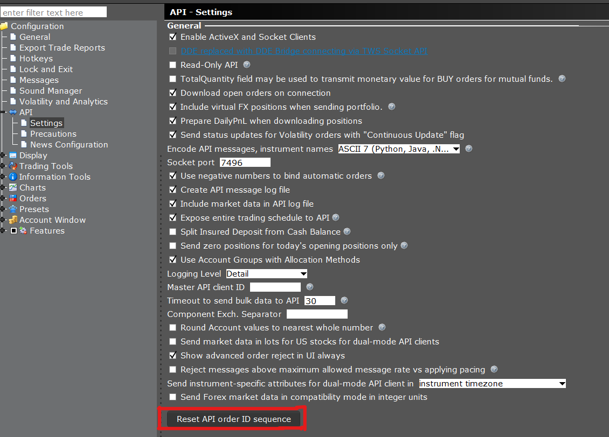

- [Next Valid Id](#next-valid-id)
  - [Reset Order ID Sequence](#reset-order-id-sequence)
  - [Request Next Valid ID](#request-next-valid-id)
  - [Receive Next Valid ID](#receive-next-valid-id)


# Next Valid Id

确实，连接到TWS后接收到的最重要事件之一是 `EWrapper.nextValidId`，它也会在调用 `EClient.reqIds` 方法后触发。正如其名称所示，`nextValidId` 事件提供了下一个有效的标识符，用于下达订单。这个标识符仅仅是序列中的下一个数字。这意味着，如果只有一个客户端应用程序向一个账户提交订单，它不需要每次提交新订单时都获取一个新的有效标识符。只需将从 `nextValidId` 方法收到的最后一个值增加1就足够了。例如，如果您的第一个API订单的有效标识符是1，那么下一个有效标识符将是2，依此类推。

然而，如果有多个客户端应用程序连接到一个账户，则有必要使用一个新订单的订单ID，该ID大于返回给客户端应用程序的所有先前订单ID，无论是在 `openOrder` 还是 `orderStatus` 回调中。例如，如果客户端被设置为主客户端，它将自动接收来自其他客户端下达订单的订单状态和交易回调。在这种情况下，`placeOrder` 中使用的任何订单ID都必须大于这些状态回调中返回的订单ID。另外，如果客户端使用了 `reqAllOpenOrders` 函数，那么该客户端随后下达的订单必须有一个大于因该函数调用而返回的所有订单的订单ID。如果您的客户端应用程序失去了序列的跟踪，您始终可以使用 `EClient.reqIds` 方法。


## Reset Order ID Sequence

确实，下一个有效的标识符（next valid identifier）在TWS会话之间是持久的。这意味着，即使在TWS重新启动或断开连接之后，下一个有效的订单ID将保持连续性，不会重置。

然而，如果需要，您可以在API设置对话框中重置订单ID序列。但请注意，只有在没有活跃的API订单时才能重置订单序列ID。这是因为重置订单ID可能会导致与现有活跃订单的冲突或混淆。

要进行重置，通常需要执行以下步骤：

1. 确保当前没有任何活跃的API订单。
2. 访问TWS的API设置对话框。
3. 找到并选择重置订单ID序列的选项。

重置订单ID序列的功能对于那些需要在特定情况下管理或同步订单编号的用户来说可能很有用，尤其是在进行大量交易或在多个会话中使用API时。然而，由于重置可能会影响订单管理的连续性和一致性，所以在执行此操作时应当谨慎。



## Request Next Valid ID

`EClient.reqIds` 是TWS API中的一个方法，用于请求当前时刻的下一个有效订单ID。尽管 `numIds` 参数在技术上是必需的，但它已经被弃用，因此提供的值不会影响返回到 `nextValidId` 的值。这个方法的参数包括：

- `numIds: int`：（已弃用）这个参数不会影响返回给 `nextValidId` 的值，但仍然是必需的。

当调用 `reqIds` 方法时，它会触发 `EWrapper.nextValidId` 回调函数，返回下一个可用的订单ID。这对于确保使用API下达的每个订单都有一个唯一且有效的ID非常重要，特别是在进行高频交易或需要确保订单顺序的场景中。

使用 `reqIds` 方法可以帮助您维护订单ID的正确顺序，确保新下达的订单不会与现有订单冲突。这在维护交易系统的一致性和可靠性方面起着关键作用。尽管 `numIds` 参数已弃用，但调用此方法仍然是获取下一个有效订单ID的标准做法。

```python
self.reqIds(-1)
```

## Receive Next Valid ID

`EWrapper.nextValidId` 是TWS API中的一个回调函数，用于接收下一个有效的订单ID。当API客户端成功连接后，或者在调用 `EClient.reqIds` 之后，这个函数会自动被触发。`EWrapper.nextValidId` 方法的参数包括：

- `orderId: int`：接收下一个有效的订单ID。

该回调函数的主要作用是提供一个可用于下达新订单的有效ID。这对于确保订单ID的唯一性和有效性至关重要，特别是在需要保持订单序列一致性的情况下。

重要的一点需要注意：

- **下一个有效的订单ID仅在接收时有效**：这意味着该ID的有效性是即时的，应该在收到后尽快使用。在高频交易或多客户端环境中，订单ID可能会快速变化，因此在使用之前，最好重新确认ID的有效性。

在单个客户端应用程序的情况下，您可以简单地在每次下单时将此ID递增。但在多客户端环境中，为了避免ID冲突，建议在每次下单前通过 `EClient.reqIds` 方法重新获取下一个有效的订单ID。这样做可以确保每个订单都有一个唯一且未被使用的订单ID，从而维护交易系统的顺序和一致性。

```python
def nextValidId(self, orderId: int):
    print("NextValidId:", orderId)
```