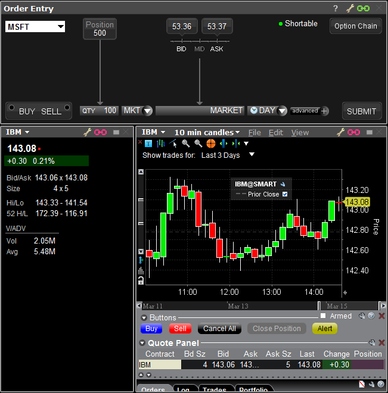

- [TWS UI Display Groups](#tws-ui-display-groups)
  - [Query Display Groups](#query-display-groups)
    - [Request Query Display Groups](#request-query-display-groups)
    - [Receive Query Display Groups](#receive-query-display-groups)
  - [Subscribe To Group Events](#subscribe-to-group-events)
    - [Request Group Events Subscription](#request-group-events-subscription)
    - [Receive Group Events Subscription](#receive-group-events-subscription)
    - [Unsubscribe From Group Events](#unsubscribe-from-group-events)
    - [Update Display Group](#update-display-group)


# TWS UI Display Groups

Display Groups功能允许API客户端与TWS颜色分组窗口（TWS Color Grouping Windows）集成。在TWS中，这些颜色分组窗口通过带颜色的链条标识，在API中则通过整数编号来标识。目前，这个编号的范围是从1到7，每个编号都映射到TWS中指示的特定颜色。

具体来说，这意味着：

- TWS颜色分组窗口允许用户将多个市场数据行（例如股票、期货、期权等）分组，并使用颜色进行标识，以便更轻松地进行视觉跟踪和管理。
- 通过API，这些分组窗口可以通过1到7的整数来引用。每个数字对应TWS中的一个特定颜色分组。
- API客户端可以使用这些编号来查询、修改或管理TWS中的颜色分组窗口。例如，API客户端可以请求将特定的市场数据行添加到某个颜色分组中，或从中移除。

这个功能对于希望通过程序化方法管理和组织其TWS界面的交易者和投资者特别有用。它使得用户可以从他们的API客户端软件直接与TWS的用户界面交互，提高了操作的效率和灵活性。通过将市场数据行组织到不同的颜色分组中，用户可以更快地识别和响应市场变化，从而改善交易决策过程。

## Query Display Groups

IBApi.EClient.queryDisplayGroups 方法用于请求TWS中所有可用的显示组。IBApi.EWrapper.displayGroupList 是对 IBApi.EClient.queryDisplayGroups 的一次性响应。

它返回一个由“|”字符分隔的可见组ID的整数列表，并按最常用的组先排序。这个列表在TWS会话期间不会改变。换句话说，用户不能添加新的组，只能改变组编号的排序。

示例：“4|1|2|5|3|6|7”

### Request Query Display Groups

`EClient.queryDisplayGroups` 是一个API方法，用于请求TWS中所有可用的显示组。此方法的参数包括：

- `requestId: int`：用于跟踪数据的请求标识符。

当调用这个方法时，它会向TWS发送一个请求来获取所有当前可用的显示组。显示组是TWS中的一种功能，允许用户将多个市场数据行组织到不同的组中，并且可以使用颜色进行标识，以便更容易地进行视觉追踪和管理。

使用 `queryDisplayGroups` 方法可以帮助API用户了解TWS界面中当前配置的显示组，这对于编程控制TWS界面或进行高级的市场数据管理非常有用。返回的数据将包括显示组的编号，这些编号可以用于后续的API调用，例如将特定的市场数据行添加到特定的显示组中。

```python
self.queryDisplayGroups(requestId)
```

### Receive Query Display Groups

`EWrapper.displayGroupList` 是TWS API中的一个回调函数，用于作为对查询显示组请求的一次性响应。此函数的参数包括：

- `requestId`：用于跟踪数据的请求标识符。
- `groups: String`：返回一个字符串，其中包含用“|”字符分隔的可见组ID的整数列表，并且按最常用的组先进行排序。

当API用户调用 `EClient.queryDisplayGroups` 方法请求TWS中的显示组时，`displayGroupList` 回调函数会被触发。它提供了当前TWS会话中所有可用显示组的详细列表，每个显示组都由一个独特的整数ID表示，并且这些ID按照使用频率的高低排序。

这个功能对于希望通过程序化方法了解和管理TWS中的显示组的用户来说非常有用。了解不同的显示组及其使用频率可以帮助用户更有效地组织和访问市场数据，从而改善交易决策过程。通过 `displayGroupList`，用户可以轻松地识别最常用的显示组，以及如何通过程序化方式与这些组进行交互。

```python
def displayGroupList(self, reqId: int, groups: str):
    print("DisplayGroupList. ReqId:", reqId, "Groups", groups)
```

## Subscribe To Group Events

为了与特定显示组（Group）集成，您首先需要通过调用 `IBApi.EClient.subscribeToGroupEvents` 方法来订阅该显示组的编号。一旦接收到订阅请求，`IBApi.EWrapper.displayGroupUpdated` 回调函数会被触发一次，并且在订阅的显示组中选定的合约发生变化时，此回调会再次发送。

具体操作步骤如下：

1. **订阅显示组**：使用 `IBApi.EClient.subscribeToGroupEvents` 方法订阅您感兴趣的显示组。您需要提供请求ID和显示组的编号作为参数。

2. **处理 `displayGroupUpdated` 回调**：一旦订阅请求被处理，`IBApi.EWrapper.displayGroupUpdated` 将会被触发。这个回调函数提供关于显示组中选定合约的更新信息。

3. **监控显示组变化**：如果在您订阅的显示组内选定的合约发生变化（例如，切换到另一个合约），`displayGroupUpdated` 回调将再次被触发，通知您这些变化。

这个功能对于需要从API客户端监控和管理TWS显示组的用户来说非常有用。通过订阅特定显示组并处理相关回调，用户可以实时了解组内选定合约的任何变化，这对于响应市场变动和进行有效的交易决策非常重要。这种集成使得API用户能够更加紧密地与TWS用户界面交互，提高了交易流程的效率和灵活性。

### Request Group Events Subscription


`EClient.subscribeToGroupEvents` 是TWS API中的一个方法，用于将API客户端与TWS窗口分组集成。此方法的参数包括：

- `requestId: int`：用于跟踪数据的请求标识符。
- `groupId: int`：要集成的显示组编号。

当您调用 `subscribeToGroupEvents` 方法时，它会订阅指定的显示组编号（groupId），从而使API客户端能够与该显示组进行交互。这个方法的主要作用是建立API客户端和TWS显示组之间的连接，使API能够接收到有关该显示组的更新和变化。

这个功能对于希望从他们的API客户端程序动态管理和监控TWS用户界面中的显示组的用户来说非常有价值。它允许用户实时跟踪显示组内选定合约的变化，以及对这些变化做出相应的反应，从而可以更高效地处理市场信息和交易数据。通过使用 `subscribeToGroupEvents` 方法，API客户端可以更紧密地与TWS界面集成，提高操作的灵活性和效率。

```python
self.subscribeToGroupEvents(19002, 1)
```

### Receive Group Events Subscription

`EWrapper.displayGroupUpdated` 是TWS API中的一个回调函数，它在接收到订阅请求后触发一次，并且如果订阅的显示组中选定的合约发生变化时，该回调会再次发送。此函数的参数包括：

- `requestId: int`：用于跟踪数据的请求标识符。
- `contractInfo: String`：为活跃显示组生成的合约信息。

当您使用 `EClient.subscribeToGroupEvents` 方法订阅特定显示组后，`displayGroupUpdated` 被触发以提供该组的当前活跃合约信息。此回调功能对于那些需要从API客户端监控和管理TWS显示组变化的用户来说非常重要。

在以下情况下，此回调函数将被触发：

1. **订阅后的首次回调**：在成功订阅显示组后，`displayGroupUpdated` 将自动触发一次，提供有关当前选定合约的信息。

2. **选定合约变化时的回调**：如果您已订阅的显示组中的选定合约发生了变化（例如，用户在TWS界面中选择了另一个合约），`displayGroupUpdated` 将再次触发，更新合约信息。

这使得API客户端可以实时了解和响应显示组中合约的变动，从而在交易决策和市场分析中利用最新的信息。通过跟踪显示组中的合约变化，用户可以确保他们的交易策略和市场监控与TWS用户界面紧密同步。

```python
def displayGroupUpdated(self, reqId: int, contractInfo: str):
    print("DisplayGroupUpdated. ReqId:", reqId, "ContractInfo:", contractInfo)
```

### Unsubscribe From Group Events

`EClient.unsubscribeFromGroupEvents` 是TWS API中的一个方法，用于取消对TWS窗口组的订阅。此方法的参数包括：

- `requestId: int`：用于跟踪数据的请求标识符。

当您调用 `unsubscribeFromGroupEvents` 方法时，它会取消之前通过 `EClient.subscribeToGroupEvents` 方法设置的特定显示组的订阅。这意味着API客户端将不再接收到有关该显示组的更新和变化。

此功能对于需要停止监控或管理特定TWS显示组的用户来说是必要的。例如，如果用户不再需要通过其API客户端跟踪特定组的市场数据变化，或者如果他们希望改变关注点到其他显示组，那么使用 `unsubscribeFromGroupEvents` 来取消当前的订阅是一个有效的操作。

取消订阅可以帮助维护API客户端的效率，确保它只接收和处理相关的数据更新，同时也可以减少不必要的数据流和系统负载。通过适时地管理订阅，用户可以确保其API客户端与TWS界面的交互更加精确和有效。

```python
self.unsubscribeFromGroupEvents(19002)
```

### Update Display Group

`EClient.updateDisplayGroup` 是TWS API中的一个方法，用于更新TWS窗口组中显示的合约。此方法的参数包括：

- `requestId: int`：用于跟踪数据的请求标识符。
- `contractInfo: String`：指定唯一IB合约的编码值。可能的值包括：
  - `none`：空选择。
  - `contractID`：任何非组合合约。例如，对于IBM在SMART和ARCA市场的合约，可以使用 "8314 for IBM SMART; 8314 for IBM ARCA"。
  - `combo`：如果选择了任何组合。

此方法用于更新在TWS中某个显示组中显示的特定合约。这对于想要通过API客户端程序动态控制TWS界面中的数据显示的用户来说非常有用。

需要注意的是，这个API请求通常不会收到TWS的响应，除非发生错误。这意味着在正常情况下，发送更新请求后，TWS不会发送确认消息，但如果有错误发生，将会收到错误信息。

例如，在您的示例中，我们已经指示TWS将链在组#1中的窗口显示为IBM@SMART。在右侧TWS Mosaic的截图中可以看到，所有粉红色链（组#1）的窗口现在都显示为IBM@SMART，而绿色链（组#4）的窗口则保持不变。这展示了如何通过API命令来控制TWS界面中特定组的显示内容。

```python
self.updateDisplayGroup(19002, "8314@SMART")
```

